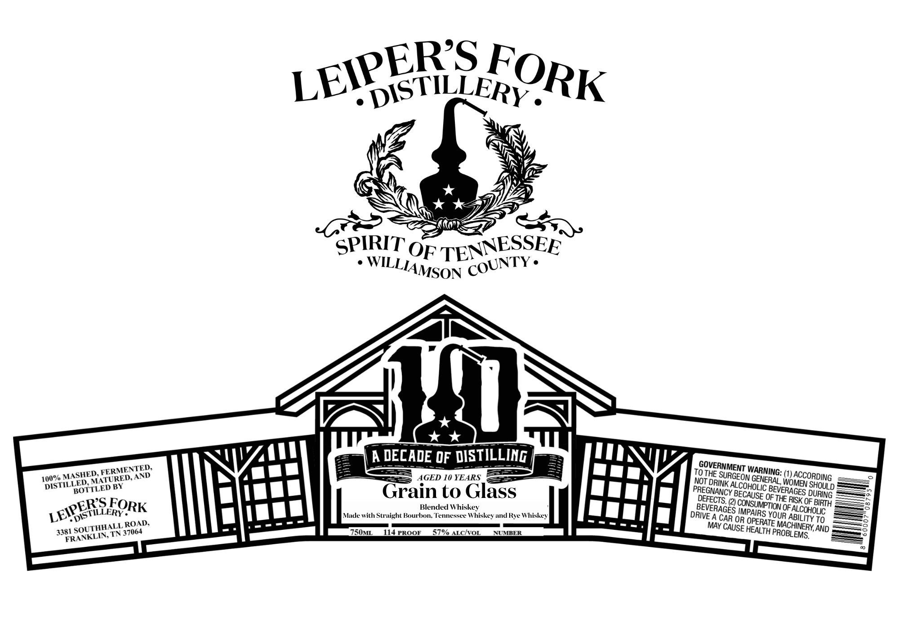

# TTB COLA Label Images - TTBID 26188001000731

**Brand Name:** LEIPER'S FORK DISTILLERY

**Issue Date:** 08/20/2026

**Origin Code:** 43

**Product Class/Type:** 137

**Source:** [TTB Public COLA Registry](https://ttbonline.gov/colasonline/viewColaDetails.do?action=publicFormDisplay&ttbid=26188001000731)

## Label Images

### Label 1

## Extracted Label Text

*Text extracted via OCR - may contain errors*

**Detected Age:** 10 Years

### Label 1

DISTILLERY .
SPIRIT OPS
'TENNESSEE
A DECADE OF DISTILLING
TOTHE
(1)
AGED 10 YEARS
NOT
BY
AL
WOMEN
Grain to Glass
DEGECTSCY BCGASSE %E THEAGESOP"
Blended Whiskey
CMPArSTOMOFASKOEOUEH
Made with Straight Bourhon Tennessee Whiskey and Rye Whiskey
DRIVE A
OR
YOUR
To
ROAD;
MAY
8
3381
TN
Z50uL
4APROOF
s% ALcIvoL
NUMBER
HEALTH PROBLE
AND
LEIPERS
FORK
WILLIAMSON
COUNTY .
GOVERNMENT
FERMENTED.
WARNING:
MASHED.
ACCORDING
SURGEON
AND
100%
MATURED.
GENERAL
DRINK
DISTILLED
SHOULD
COHOLIC
BOTTLED
PREGNANCY
BEVERAGES
DURING
LEIPERS _
FORK
BEVERAGES
IMPAIRS
DISTILLERY
ABILITY
CAR
OPERATE
MACHINERY,
SOUTHHALL
CAUSE
37064
EMS.
FRANKLIN;
