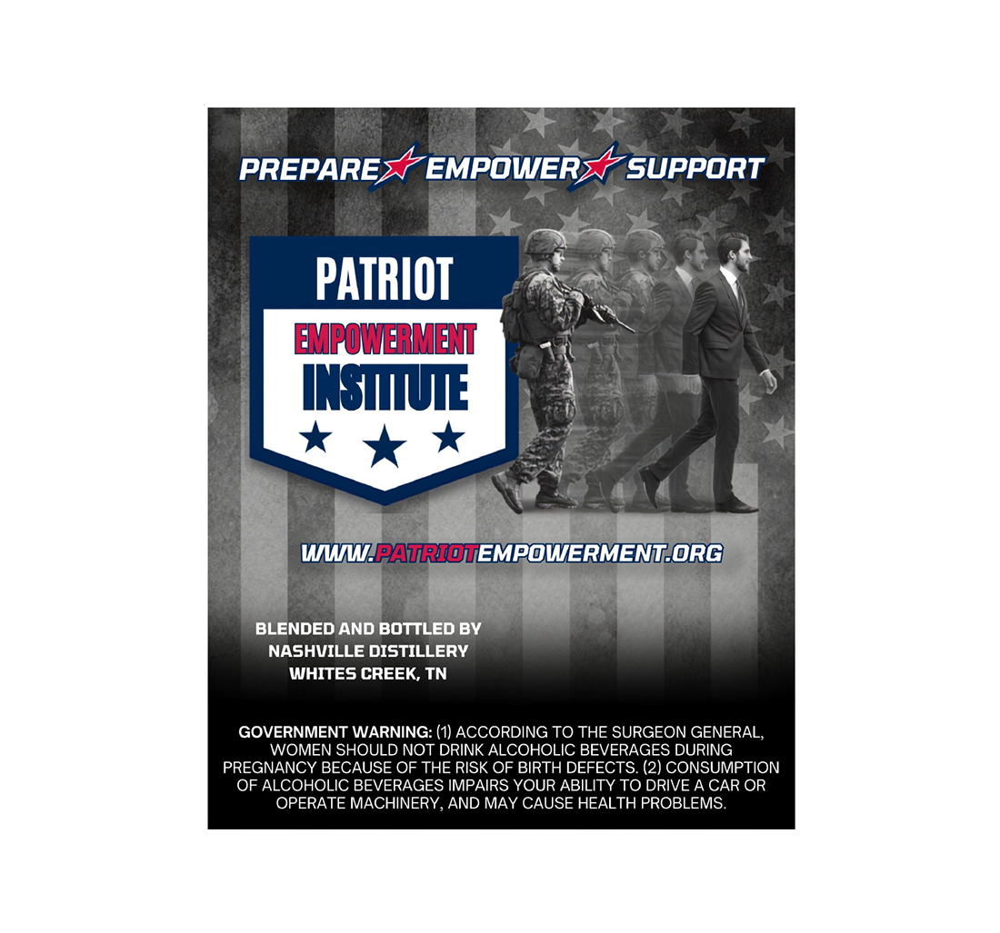
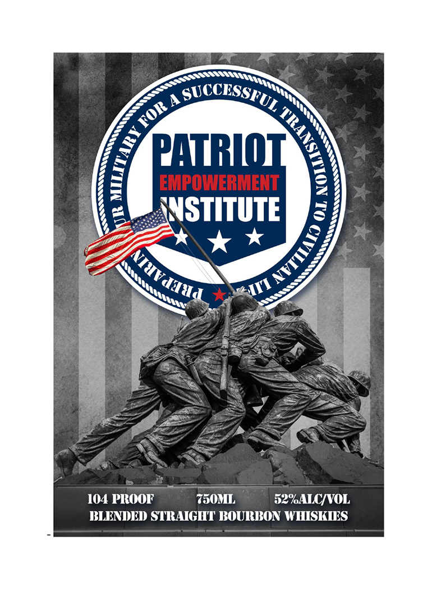

# TTB COLA Label Images - TTBID 26188001000791

**Brand Name:** PATRIOT EMPOWERMENT INSTITUTE

**Issue Date:** 07/10/2026

**Origin Code:** 43

**Product Class/Type:** 121

**Source:** [TTB Public COLA Registry](https://ttbonline.gov/colasonline/viewColaDetails.do?action=publicFormDisplay&ttbid=26188001000791)

## Label Images

### Back Label

### Front Label

## Extracted Label Text

*Text extracted via OCR - may contain errors*

### Back Label

PREPARE
EMPOWER
SUPPORT
PATRIOT
MFOWBVET
INSIIUE
Wn-PAtRIOvEMOWERMENTORG
BLENDED AND BOTTLED BY
NASHVILLE DISTILLERY
WHITES CREEK, TN
GOVERNMENT WARNING: (1) ACCORDING TO THE SURGEON GENERAL,
WOMEN SHOULD NOT DRINK ALCOHOLIC BEVERAGES DURING
PREGNANCY BECAUSE OF
RISK OF BIRTH DEFECTS: (2) CONSUMPTION
OF ALCOHOLIC BEVERAGES IMPAIRS YOUR ABILITY TO DRIVE A CAR OR
OPERATE MACHINERY AND MAY CAUSE HEALTH PROBLEMS:
THE

### Front Label

p
PATTRIOI
EMPOWERMENT
WVSTITUTE
104 PIROOF
750ML
52%AIC/VOL
BLENI)EI) STRAIGHT' BOUIRIXON WHISKIES
SUCCESSTUL
FOR
1
1
NIHVaTad
Lliiess~
