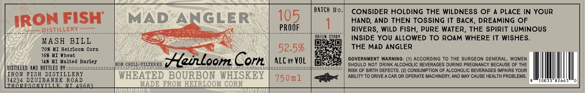

# TTB COLA Label Images - TTBID 26189001000038

**Brand Name:** MAD ANGLER

**Issue Date:** 07/14/2026

**Origin Code:** 06

**Product Class/Type:** 141

**Source:** [TTB Public COLA Registry](https://ttbonline.gov/colasonline/viewColaDetails.do?action=publicFormDisplay&ttbid=26189001000038)

## Label Images

### Label 1

## Extracted Label Text

*Text extracted via OCR - may contain errors*

**Detected Proof:** 105

### Label 1

BATCH No
CONSIDER HOLDING THE WILDNESS OF
PLACE IN YOUR
IRON FISH
MAD
ANGLER
105
HAND, AND THEN TOSSING It BACK, DREAMING OF
DISIILLERY
PROOF
RIVERS, WILD FISH, PURE WATER_
THE SPiRIT LUMINOUS
MASH
BILL
Wrislk sioey
INSIDE YOU ALLOWED TO ROAM WHERE IT WISHES_
70% KI Heirloon Corn
52.5%
THE MAD ANGLER
16% HI Wheat
143 MI
Kalted Barley
HHeinLoom Corn
ALC By VOL
GOVERNMENT WARNING: (1) ACCORDinG To THE SURGEON
GENERAL;
WOMEN
NOR CHILI-FILTERED
SHOULD NOT DRINK ALCOHOLIC BEVERAGES DURING PREGNANCY BECAUSE OF THE
DISTILLED AMD  BOTTLED BY;_
RISK OF BIRTH DEFECTS. (2) CONSUMPTION OF ALCOHOLIC BEVERAGES IMPAIRS YOUR
IRon FISH DISTILLERY
WHEATED BOURBON WHISKEY
75 0ml
ABILITY TO DRIVE _
CAR OR OPERATE MACHINERY; AND MAY CAUSE HEALTH PROBLEMS:
14234 DZUIBANEK ROAD
THOMESOLLLLE
W9683
KADE FROK HEIRLOOM CORM
