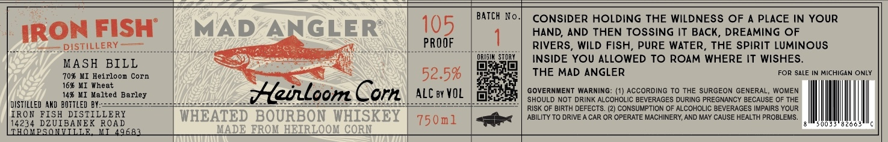

# TTB COLA Label Images - TTBID 26189001000039

**Brand Name:** MAD ANGLER

**Issue Date:** 07/14/2026

**Origin Code:** 06

**Product Class/Type:** 141

**Source:** [TTB Public COLA Registry](https://ttbonline.gov/colasonline/viewColaDetails.do?action=publicFormDisplay&ttbid=26189001000039)

## Label Images

### Label 1

## Extracted Label Text

*Text extracted via OCR - may contain errors*

**Detected Proof:** 105

### Label 1

BATCH No_
CONSIDER HOLDING THE WILDNESS OF
PLACE IN YOUR
IRON FISH"
MAD
ANGLER
105
HAND, AND THEN TOSSING IT BACK, DREAMING OF
ISIILLERY
PROOF
RIVERS, WILD FISH, PURE WATER_
THE SPiRIT LUMINOUS
MASH
BILL
OELGIL Siday
INSIDE YOU ALLOWED TO ROAM WHERE IT WISHES_
70% HI Heirloom Corn
52.5%
THE MAD ANGLER
FOR SALE IN MICHIGAN ONLY
16% MI Wheat
14% KI Melted Barley
HeunLoom Corn_
ALC by VOL
GOVERNMENT WARNING_
(1) ACCORDING TO THE SURGEON GENERAL
WOMEN
SHOULD NOT DRINK ALCOHOLIC BEVERAGES DURING PREGNANCY BECAUSE OF THE
DISTILLED AHd  ?OTTLEd BY:=
RISK OF BIRTH DEFECTS: (2) CONSUMPTION OF ALCOHOLIC BEVERAGES IMPAIRS YOUR
IRON
FISH DISTILLERY
WHEATED BOURBON WHISKEY
750m1
ABILITY TO DRIVE A CAR OR OPERATE MACHINERY; AND MAY CAUSE HEALTH PROBLEMS _
14234 DZUIBANEK ROAD
2663
DOPSOLLLLLE
ML496BL
MADE FROL HEIRLOOM CORN
