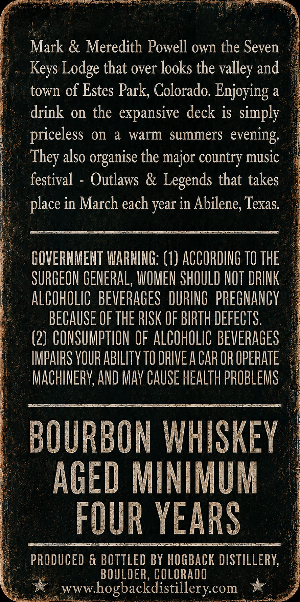
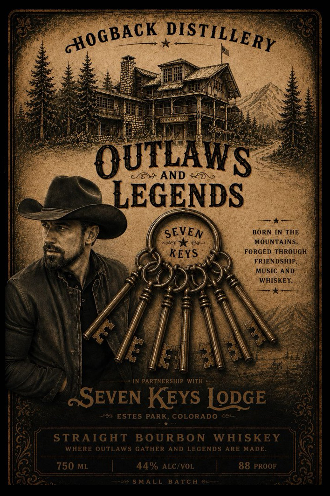

# TTB COLA Label Images - TTBID 26189001000165

**Brand Name:** HOGBACK DISTILLERY

**Fanciful Name:** OUTLAWS & LEDGENDS

**Issue Date:** 07/09/2026

**Origin Code:** 13

**Product Class/Type:** 101

**Source:** [TTB Public COLA Registry](https://ttbonline.gov/colasonline/viewColaDetails.do?action=publicFormDisplay&ttbid=26189001000165)

## Label Images

### Back Label

### Front Label

## Extracted Label Text

*Text extracted via OCR - may contain errors*

**Detected Proof:** 88

### Back Label

Mark & Meredith Powell own the Seven
Lodge that over looks the
and
town of Estes Park, Colorado. Enjoying a
drink
on the
expansive deck is Simply
priceless on
a
warm
summers
evening:
also
the major country music
festival
Outlaws & Legends that takes
place in March each year in Abilene; Texas
GOVERNMENT WARNING: (1) ACCORDING TO THE
SURGEON GENERAL, WOMEN SHOULD NOT DRINK
ALCOHOLIC   BEVERAGES  DURING   prEGhancV
BECAUSE OF THE RISK OF BIRTH DEFECTS.
(2} CONSUMPTION OF ALCOHOLIC BEVERAGES
IMPAIRS VOUR ABILITv TO DRIVE A CAR OR OPERATE
MACHINERV; AND MaV CAUSE HEALTH PROBLEMS
BOURBON WHISKEY
AGED MINIMUM
FOUR YEARS
PRODUCED & BOTTLED BY HOGBACK DISTILLERY,
BOULDER, COLORADO
wwwhogbackdistillerycom
Keys
valley
They "
organise

### Front Label

OULAWS
AND
LEGENDS
SEVEN
BORN IN THE
7
MOUNTAINS.
KEYS
FORGED THROUGH
FRIENDSHIP
MUSIC AND
WHISKEY
6 [eale
IN PARTNERSHIP
WiTh
~SEVEN KEYS [ODGE
ESTES PARK, COLORADO
STRAIG HT
BOURBO N
WHISKEY
WHERE OUTLAWS GATHER AND LEGENDS ARE MADE
750 ML
44% ALC/VOL
88 PROOF
5 MALL
BATC H
GHOGBACK
DISTILLERY
