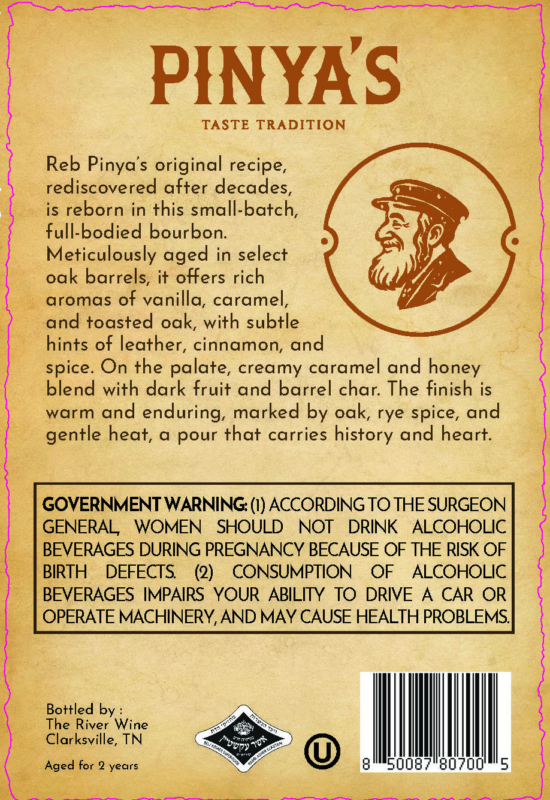
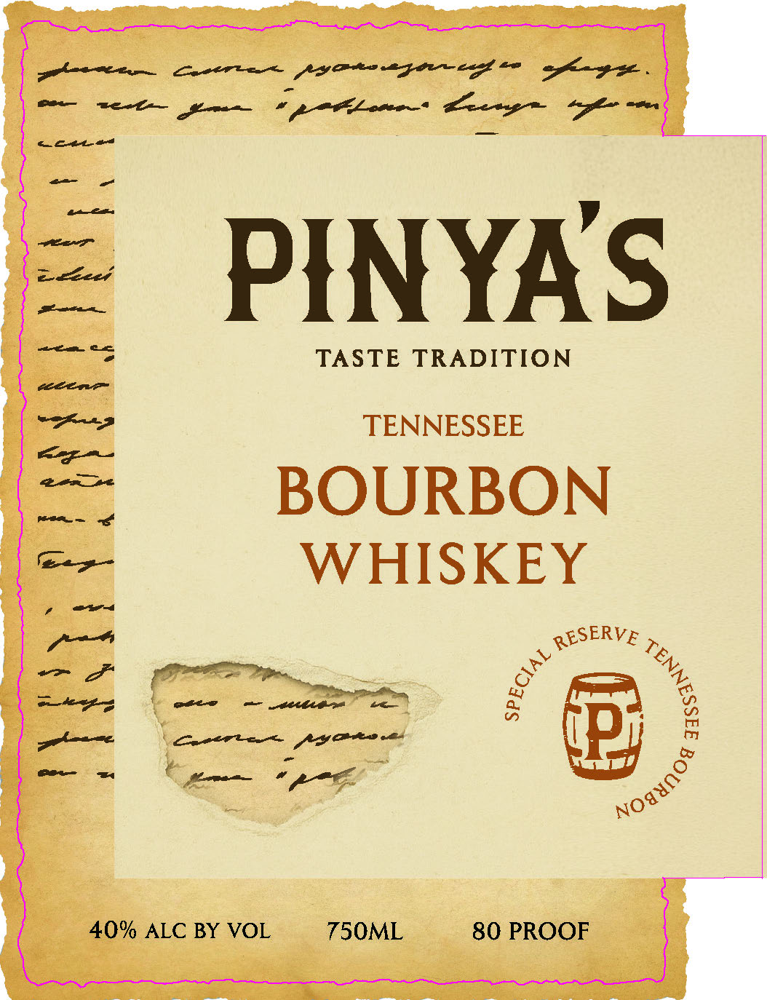

# TTB COLA Label Images - TTBID 26189001000221

**Brand Name:** PINYA'S

**Issue Date:** 07/13/2026

**Origin Code:** 43

**Product Class/Type:** 141

**Source:** [TTB Public COLA Registry](https://ttbonline.gov/colasonline/viewColaDetails.do?action=publicFormDisplay&ttbid=26189001000221)

## Label Images

### Back Label

### Front Label

## Extracted Label Text

*Text extracted via OCR - may contain errors*

**Detected Proof:** 80
**Detected Age:** 2 Years

### Back Label

PFNYAS
TASTE
TRADITION
Reb Pinya's original recipe,
rediscovered after decades,
is reborn in this small-batch
full-bodied bourbon:
Meticulously
in select
oak barrels, it offers rich
aromas of vanilla, caramel
and toasted oak, with subtle
hints of leather, cinnamon, and
On the palate, creamy caramel and honey
blend with dark fruit and barrel char: The finish is
warm and enduring, marked by oak, rye spice, and
heat; a pour that carries history and heart:
GOVERNMENT WARNING: (1) ACCORDING TO THE SURGEON
GENERAL
WOMEN
SHOULD
NOT
DRINK
ALCOHOLIC
BEVERAGES DURING PREGNANCY BECAUSE OF THE RISK OF
BIRTH
DEFECTS
(2)
CONSUMPTION
OF
ALCOHOLIC
BEVERAGES IMPAIRS YOUR
ABILITY
TO DRIVE
A
CAR OR
OPERATE MACHINERY,AND MAY CAUSE HEALTH PROBLEMS
Bottled by
The River Wine
Clarksville, TN
07AV
Aged for 2 years
aged
spice.
gentle
Norty

### Front Label

phn Sacer ry eteugaw eg te agkagse

cceres

nat ce ae eae ee uae ie

.

ee

tee aa

eetee/

nee ae

PINYAS

en

elon

TASTE TRADITION

etree

TENNESSEE

tm we

—

om ng

BOURBON

aed

WHISKEY

ee >

—> f*

OPE hip,

~~

ee

anes > _gscgegee ae

ore AY PR oes

eo om

oe

(By

re]

&

40% ALC BY VOL

750ML

oss
