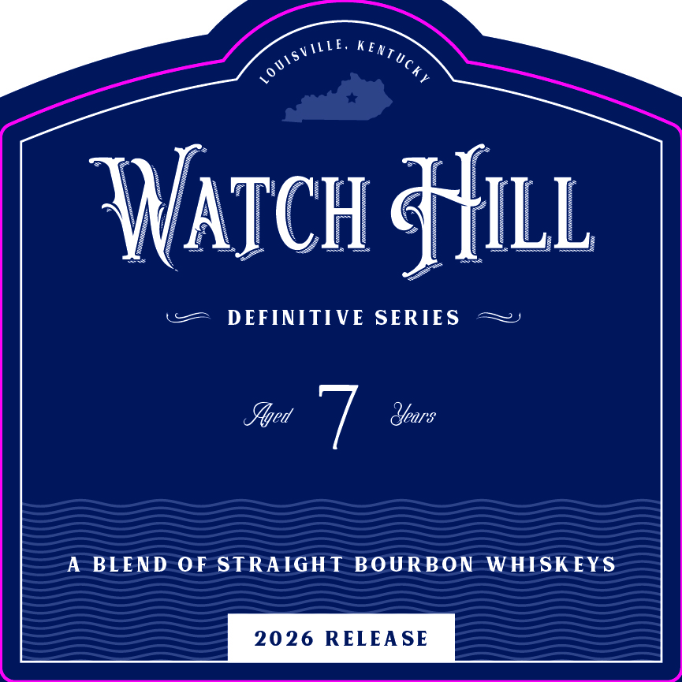
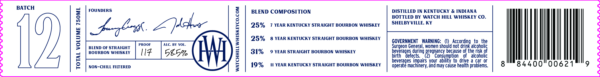

# TTB COLA Label Images - TTBID 26189001000264

**Brand Name:** WATCH HILL WHISKEY CO.

**Fanciful Name:** DEFINITIVE SERIES - A BLEND OF STRAIGHT BOURBON WHISKEYS

**Issue Date:** 07/14/2026

**Origin Code:** 22

**Product Class/Type:** 121

**Source:** [TTB Public COLA Registry](https://ttbonline.gov/colasonline/viewColaDetails.do?action=publicFormDisplay&ttbid=26189001000264)

## Label Images

### Front Label

### Label 1

## Extracted Label Text

*Text extracted via OCR - may contain errors*

**Detected Proof:** 62
**Detected Age:** 7 Years

### Front Label

Iatch Hill
DEFINITIVE SERIES
Ylyed
Years
A BLEND OF STRAIGHT BOURBON
WHISK EYS
2026 RELEA SE
MI,
KenTucky
10 UISV

### Label 1

BATCH

FOUNDERS

BLEND COMPOSITION

DISTILLED IN KENTUCKY & INDIANA

BOTTLED BY WATCH HILL WHISKEY CO.

25%

7 YEAR KENTUCKY STRAIGHT BOURBON WHISKEY

SHELBYVILLE, KY

pgboh. Z cher

25%

8 YEAR KENTUCKY STRAIGHT BOURBON WHISKEY

GOVERNMENT WARNING: (1) According to the

Surgeon General, women should not drink alcoholic

beverai

31%

9 YEAR STRAIGHT BOURBON WHISKEY

birth

4

es during

lefects.

2)

regnancy because of the risk of

G

) Consumption of alcoholic

19%

11 YEAR KENTUCKY STRAIGHT BOURBON WHISKEY

beverages impairs your ability to drive a car or

84400 00621

|

7

NON-CHILL FILTERED

operate machinery, and may cause health problems.
