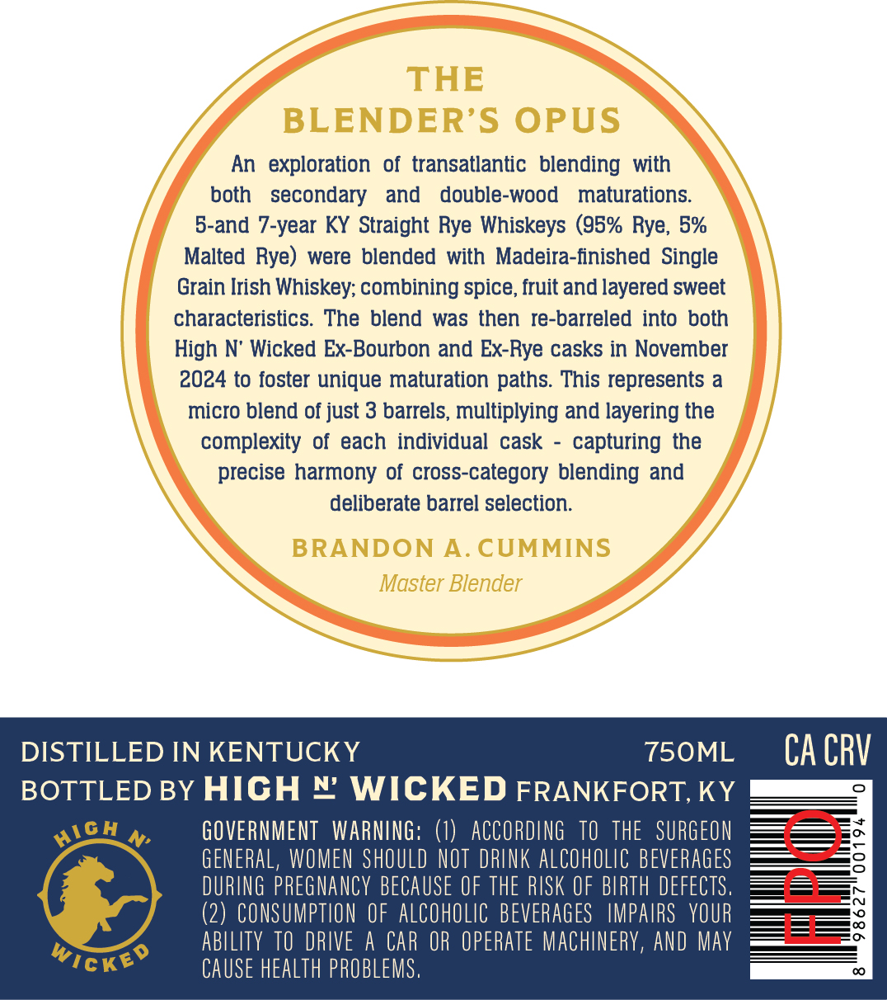
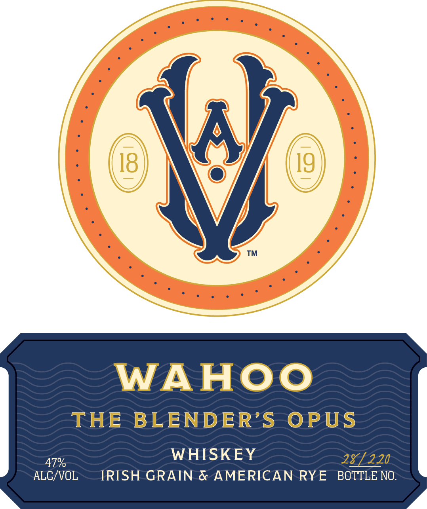

# TTB COLA Label Images - TTBID 26189001000273

**Brand Name:** WAHOO

**Fanciful Name:** THE BLENDER'S OPUS

**Issue Date:** 07/13/2026

**Origin Code:** 22

**Product Class/Type:** 140

**Source:** [TTB Public COLA Registry](https://ttbonline.gov/colasonline/viewColaDetails.do?action=publicFormDisplay&ttbid=26189001000273)

## Label Images

### Back Label

### Front Label

### Label 3

## Extracted Label Text

*Text extracted via OCR - may contain errors*

*1 image(s) excluded: text did not meet readability threshold*

### Back Label

THE
BLENDER'S OPUS
An  exploration   of  transatlantic   blending with
both   secondary
and
double-wood
maturations:
5-and 7-year KY Straight Rye Whiskeys (95% Rye, 5%
Malted Rye)
were blended with Madeira-iinished  Single
Grain Irish Whiskey; combining spice, fruit and layered sweet
characteristics.  The blend
was then re-barreled into both
High N
Wicked Ex-Bourbon and Ex-Rye casks in November
2024 to foster unique maturation paths This represents a
micro blend of just 3 barrels, multiplying and layering the
complexity of each individual cask
capturing the
precise harmony of croSs-category blending and
deliberate barrel selection.
BRANDON
A. CUMMINS
Master Blender
DISTILLED IN KENTUCKY
750ML
CA CRV
BOTTLED BY HICH N WICKED FRANKFORT,KY
M
GOVERNMENT   WARNING: ()
ACCORdING   TO   thE   SURGEON
GENERAL, WOMEN ShOULD NOT DRLNK AlCohollc BEVERAGes
DURING pREGNAncY BECAUSE OF thE RISK €F BIRTH defectS.
(2) CONSUMPTION €F  alCohOLIc BEvERaGes   IMPAIRS   YOUR
abllity TO DRIVE
H
CAR OR operate MachinerY, ANd May
Wickeo
CAUSE health PROBLeMS ,
HicH

### Front Label

(a)

™

WAHOO

THE BLENDER’S OPUS

WHISKEY

2E7 220

ALCVOL

IRISH GRAIN & AMERICAN RYE BOTTLE NO
