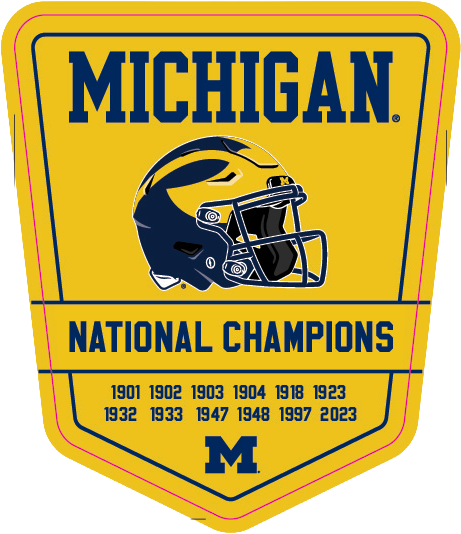
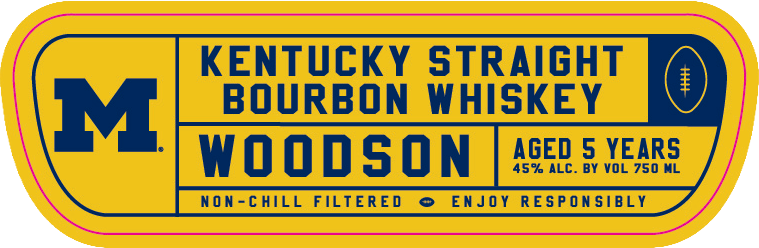
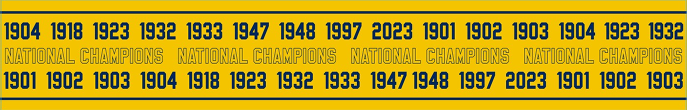

# TTB COLA Label Images - TTBID 26189001000333

**Brand Name:** WOODSON

**Fanciful Name:** MICHIGAN NATIONAL CHAMPIONS

**Issue Date:** 07/10/2026

**Origin Code:** 01

**Product Class/Type:** 101

**Source:** [TTB Public COLA Registry](https://ttbonline.gov/colasonline/viewColaDetails.do?action=publicFormDisplay&ttbid=26189001000333)

## Label Images

### Back Label

### Front Label

### Label 4

## Extracted Label Text

*Text extracted via OCR - may contain errors*

*2 image(s) excluded: text did not meet readability threshold*

**Detected Proof:** 90
**Detected Age:** 5 Years

### Front Label

KENTUcKY STRAIGHT
M
BOURBON WHISKEY
WoodSON
AGED 5 YEARS
45% ALC
BY VOL 750 ML
non-chIll FILTERED
EnJoy REsPOn SIBLY
