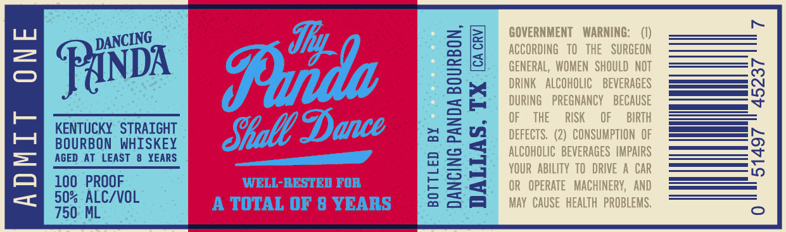
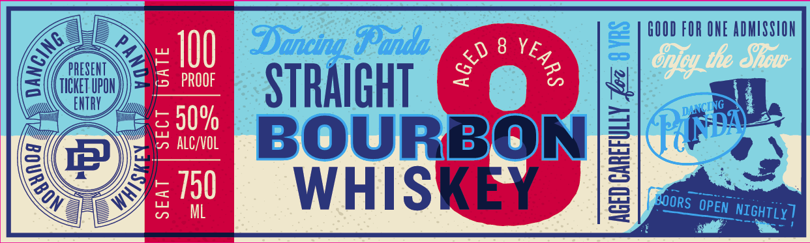

# TTB COLA Label Images - TTBID 26189001000428

**Brand Name:** DANCING PANDA

**Issue Date:** 07/10/2026

**Origin Code:** 44

**Product Class/Type:** 101

**Source:** [TTB Public COLA Registry](https://ttbonline.gov/colasonline/viewColaDetails.do?action=publicFormDisplay&ttbid=26189001000428)

## Label Images

### Back Label

### Front Label

## Extracted Label Text

*Text extracted via OCR - may contain errors*

**Detected Proof:** 100
**Detected Age:** 8 Years

### Back Label

N
GOVERNMENT
WARNING;
3 RiNda
Tuda
#
GENERaL GVOweN HEHoGhbGeDy
DRINK
ALCOHOLIC
BEVERAGES
8
F
DURING
PREGNANCY
BECAUSE
KENTUCKY   STRAIGHT
Dance
3
OF
THE
RISK
OF
BIRTH
Siall =
3
DEFECTS   (2)   CONSUMPTION  OF
1
BGURBONEASTHI SKEY
1
KUOrHObe BeveR GEVE MpGRR
5
100   PROOF
WELL-RESTED FOR
Il
OR   OpERATE  MACHINERY,   AND
50% ALC/VOL
TOTAL OF 8 YEARS
May  CAUSE  HEALTH  PROBLEMS ,
750 ML
DANCING

### Front Label

GOOD FOR ONE ADMISSION
1OO
Dancing_QPunda;
8
2
ezfoy tle Siow
PRESENT
5
PROOF
TICHET UPON
STRAIGHT
ENTRY
5 609
alC/vOL
BOURBON
1
P16DT
3750
WHISKEY
BOORS
ML
NIGHTLY ]
(
2
3
DANCING
{
B
OPEN
