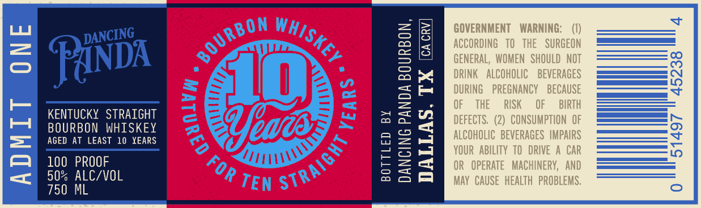
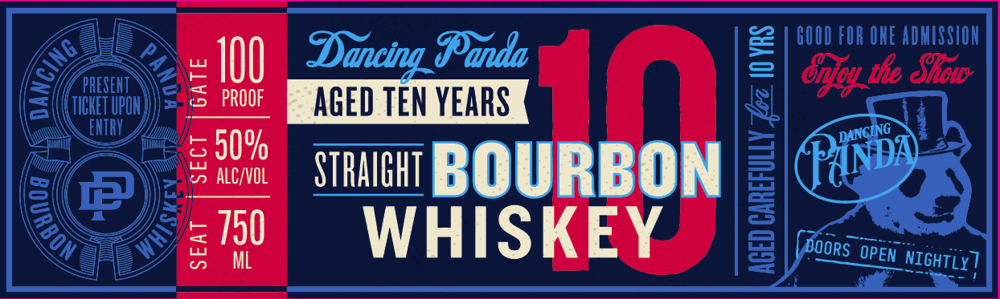

# TTB COLA Label Images - TTBID 26189001000435

**Brand Name:** DANCING PANDA

**Issue Date:** 07/10/2026

**Origin Code:** 44

**Product Class/Type:** 101

**Source:** [TTB Public COLA Registry](https://ttbonline.gov/colasonline/viewColaDetails.do?action=publicFormDisplay&ttbid=26189001000435)

## Label Images

### Back Label

### Front Label

## Extracted Label Text

*Text extracted via OCR - may contain errors*

**Detected Proof:** 100

### Back Label

GOVERNMENT
WARNING:
3
19
GERERBINGVOMEN
NTHSHOCLRGEOT
FanDa
J
F
DRINK   AlCOHOLIC
BEVERAGES
3
DURING
PREGNANCY
BECAUSE
KENTUCKY   STRAIghT
2
3
OF
THE
RISK
OF
BIRTH
BOURBON  WHISKEY
Yeade
m
DEFECTS   (2)   CONSUMPTION  OF
1
AGED At LEAST
10   XEARS
]
Kuorhqbietever Abrne Mpoar
5
100   PROOF
13
OR
opeRATe   MACHINERV,   ANd
50% ALC/VOL
TEN
May   CAUSE   hEALTH  PROBLEMS;
750 ML
BOURBON
WHISKEY _
DANCING
{
STRAIGHT
QD
FOR `

### Front Label

GOOD FOR ONE ADMISSIOH
PRESENT
3 /00
Dancing Danda
I
2 |"guMonao
TICHET UPOH
PROOF
AGED TEN YEARS
ENTRY
5 609
alC/vOL
STRAIHHT BOURBON
Pinda
4750
ML
WHISKEY
0
0
DANCING
9
DOORS
OPEN
NIGHTLY
