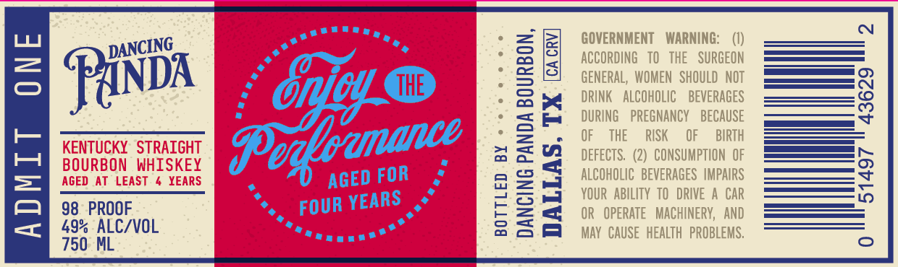
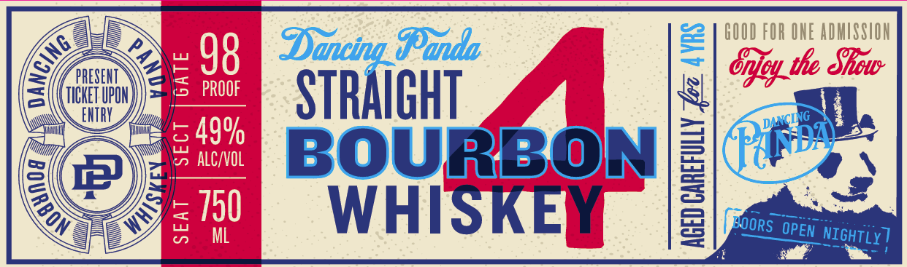

# TTB COLA Label Images - TTBID 26189001000441

**Brand Name:** DANCING PANDA

**Issue Date:** 07/13/2026

**Origin Code:** 43

**Product Class/Type:** 101

**Source:** [TTB Public COLA Registry](https://ttbonline.gov/colasonline/viewColaDetails.do?action=publicFormDisplay&ttbid=26189001000441)

## Label Images

### Back Label

### Front Label

## Extracted Label Text

*Text extracted via OCR - may contain errors*

**Detected Proof:** 98

### Back Label

C
GOVERNMENT
WARNING;
(1)
3
F
GENERBLNWOEN
NThshobubGeOT
PanDx
Onjoy G
THE
DRINK   AlCOHOLIC
BEVERAGES
8
F
DURING
PREGNANCY
BECAUSE
KENTUCKY   STRAIGHT
3
OF
THE
RISK
OF
BIRTH
3
DEFECTS:   (2)   CONSUMPTION  OF
BOURBON   WHISKEY
1
AGED AT   LEAST
YEARS
AGED FOR
1
KOORFOBILITEVER BESE MPGAR
5
98   PROOF
FOUR YEARS
II
OR   opeRaTe  MachIneRV,   ANd
49% ALC/VOL
May   CAUSE   HEaLTh  PROBLEMS,
750 ML
DANCING
Dedbanance

### Front Label

GOOD FOR ONE AdMSSIOH
98
Dancing_Danda
4
tle SRcw
{TILREHUPOH
5
PROOF
STRAIGHT
4
ENTRY
549w6
alC/VOL
BOURBON
Paon
L
5750
ML
WHISKEY
]
OPEN NIGHTLY ?
0
2
Onoy
DANCING
0
B
BOORS
