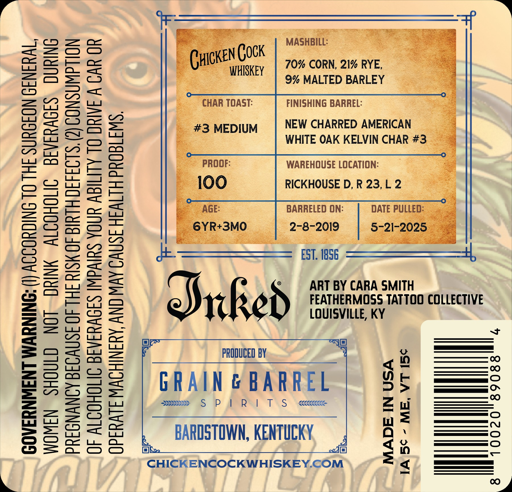
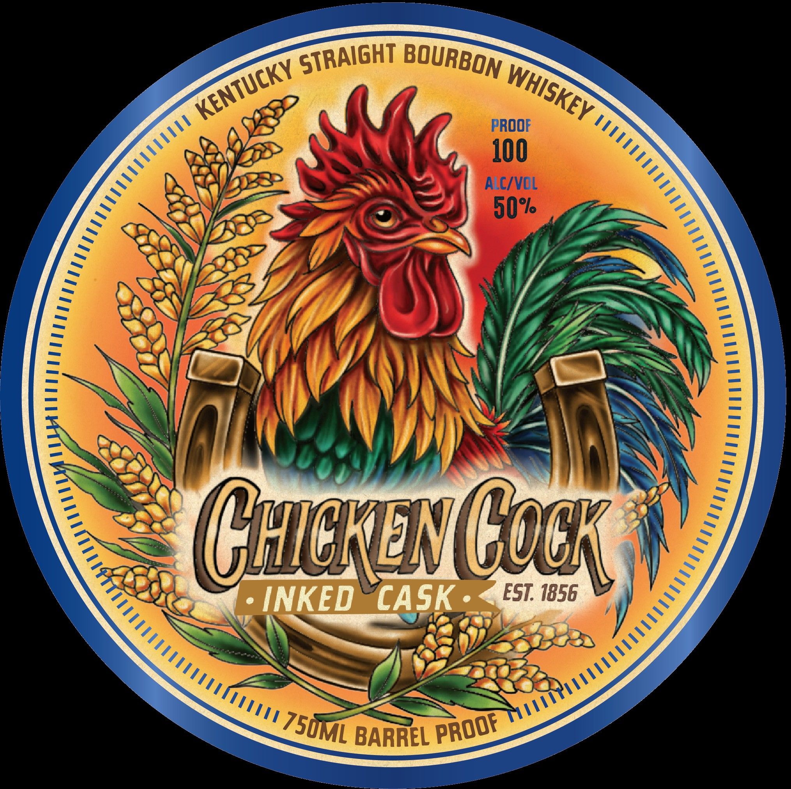

# TTB COLA Label Images - TTBID 26189001000580

**Brand Name:** CHICKEN COCK

**Issue Date:** 07/10/2026

**Origin Code:** 22

**Product Class/Type:** 101

**Source:** [TTB Public COLA Registry](https://ttbonline.gov/colasonline/viewColaDetails.do?action=publicFormDisplay&ttbid=26189001000580)

## Label Images

### Back Label

### Front Label

## Extracted Label Text

*Text extracted via OCR - may contain errors*

**Detected Proof:** 100

### Back Label

(I) ACCORDING 10 THE SURGEON GENERAL,

WOMEN SHOULD NOT DRINK ALCOHOLIC BEVERAGES DURING
PREGNANCY BECAUSE OF THE RISK OF BIRTH DEFECTS. (2) CONSUMPTION

OF ALCOHOLIC BEVERAGES IMPAIRS YOUR ABILITY TO DRIVE A CAR OR

OPERATE MACHINERY, AND MAY CAUSE HEALTH PROBLEMS.

GOVERNMENT WARNING

70% CORN, 21% RYE,
9% MALTED BARLEY
FINISHING BARREL:

NEW CHARRED AMERICAN
WHITE OAK KELVIN CHAR

WAREHOUSE LOCATION:
RICKHOUSE D, R 23, L 2 3

BARRELED ON:
2-8-2019

ai

re ower * =

x ART BY CARA SMITH
FEATHERMOSS TATTOO COLLECTIVE
LOUISVILLE, KY

DATE PULI

me IC] —<——
B PRODUCED BY 4 , io ——0
GRAIN & BARREL
Seas S PPR | TS -xqceee za Wi SSS
n= =——C

x BARDSTOWN, KENTUCKY =f dl HH
si $ _—s
CHICKENCOCKWHISKEY. COM < }_—__|
[oe]

Ww

### Front Label

PROOF
100
ALC/VOL
50%
CHcKovGock
INKED
CASK
EST: 1856
BARREL
STRAIGHT
BOURBON
KENTUCKY
WHISKEY
MI
[
MIIL
750ML
PROof
