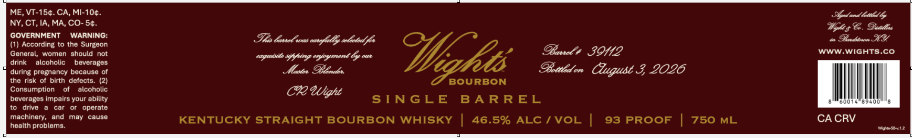

# TTB COLA Label Images - TTBID 26189001000588

**Brand Name:** WIGHT'S

**Issue Date:** 07/09/2026

**Origin Code:** 22

**Product Class/Type:** 101

**Source:** [TTB Public COLA Registry](https://ttbonline.gov/colasonline/viewColaDetails.do?action=publicFormDisplay&ttbid=26189001000588)

## Label Images

### Label 1

## Extracted Label Text

*Text extracted via OCR - may contain errors*

**Detected Proof:** 93

### Label 1

ME, VT-15¢. CA, MI-10¢.

Gad and betild by

NY, CT, IA, MA, CO- 5¢.

GOVERNMENT WARNING:

Uglts Ce. Desltrs

Ths bancl was sarglel ly wletad fs

0» Bencbiown HY

(1) According to the Surgeon

WWW.WIGHTS.CO

Gen

, women should not

capacils sifting eycymont fy our

Baw ZOE

drink alcoholic

beverages

during pregnancy because of

Maser Blends.

Bottled on Clugubt 3 2026

the risk of birth defects. (2)

BOURBON

Consumption

of

alcoholic

beverages impairs your ability

CR Wight

SINGLE BARREL

to drive a car or operate

machinery, and may cause

health problems.

KENTUCKY STRAIGHT BOURBON WHISKY | 46.5% ALC / VOL |

93 PROOF

750 ML

CACRV

womssi2
