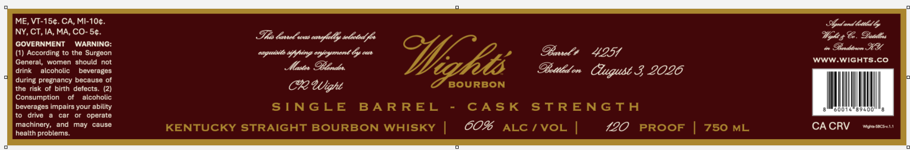

# TTB COLA Label Images - TTBID 26189001000592

**Brand Name:** WIGHT'S

**Issue Date:** 07/09/2026

**Origin Code:** 22

**Product Class/Type:** 101

**Source:** [TTB Public COLA Registry](https://ttbonline.gov/colasonline/viewColaDetails.do?action=publicFormDisplay&ttbid=26189001000592)

## Label Images

### Label 1

## Extracted Label Text

*Text extracted via OCR - may contain errors*

**Detected Proof:** 120

### Label 1

ME,VT-15c. CA, MI-104_
S Jewd 6ttluly
NY, CT,IA,MA, CO- 5c.
Is lstelrs cobefuudly tlaetad /
%fAs&. Iedr
GOVERNMENT
WARNING:
9,43%
According to the Surgeon
argeutisede Myhting eojcyment Gy _
Ctt
@Bawel}
4251
General;
women   should not
WWW.Wights.co
drink
alcoholic
beverages
Mastet OBlendet
OBottled on
3 2026
during pregnancy because of
the risk of birth defects
CP "iaht
BOURBON
Consumption
alcoholic
beverages impairs your ability
STNGLE
BA R REL
CA S K
StRENGtA
6D0 1
drive
car
operate
machinery,
and
may
cause
KENTUCKY STRAIGHT BOURBON WHISKY
60%
ALC / VOL
120
PROOF
750 ML
CA CRV
Ae SleSa
health problems.
ettiakhd
Cugust _
