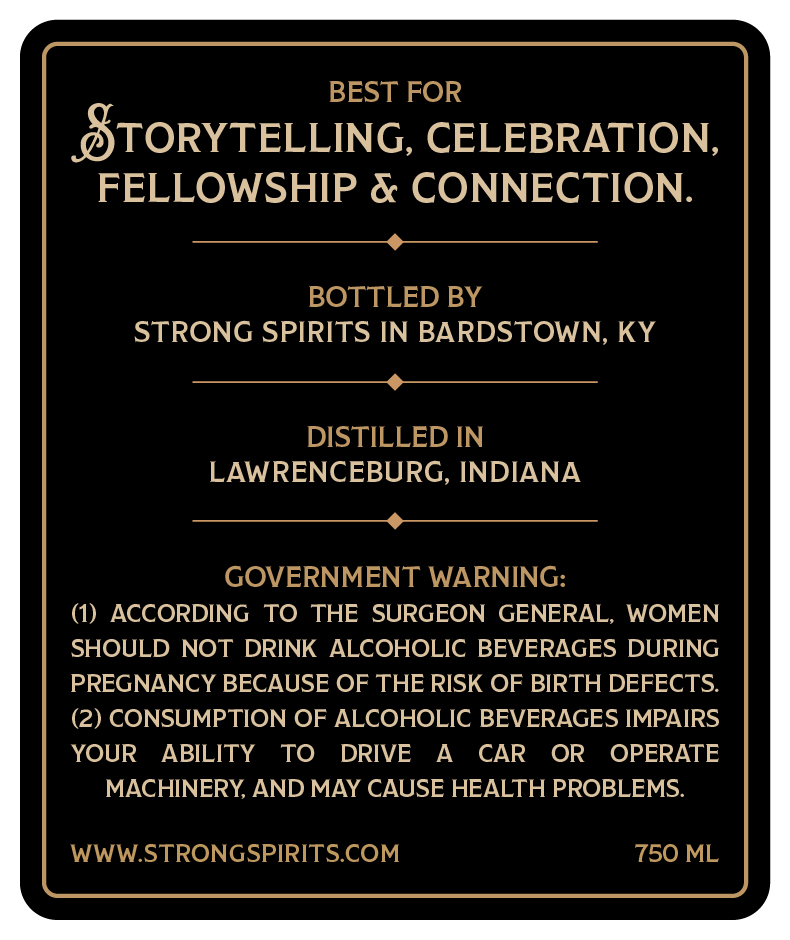
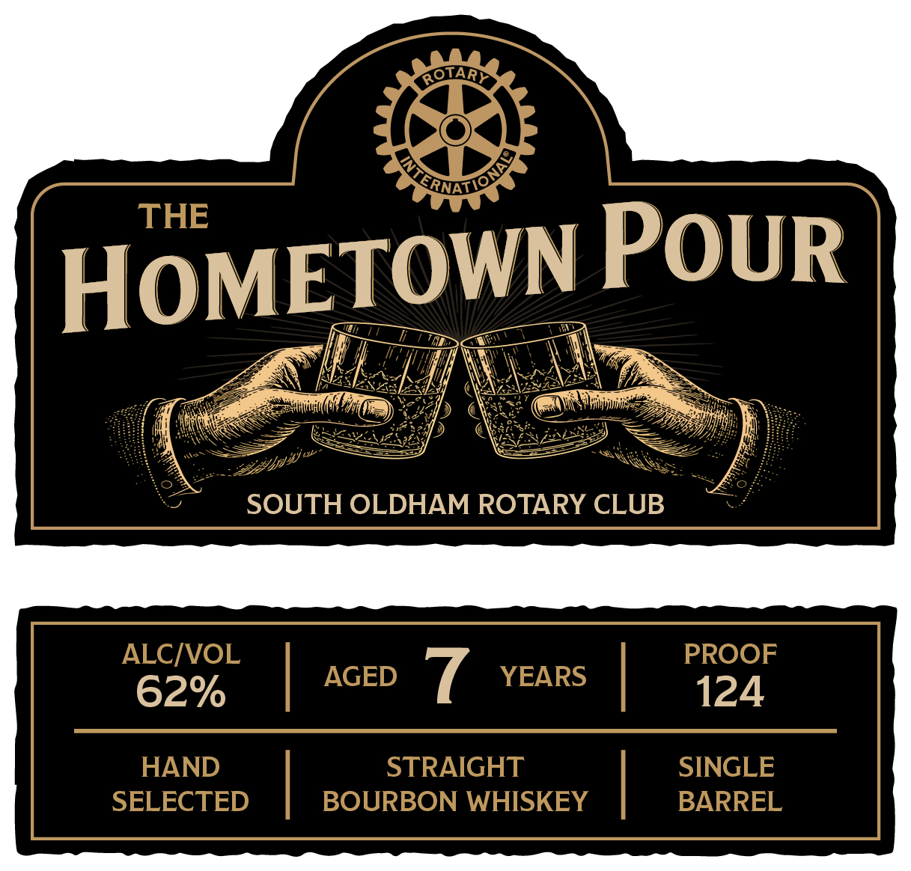

# TTB COLA Label Images - TTBID 26189001000662

**Brand Name:** THE HOMETOWN POUR

**Issue Date:** 07/10/2026

**Origin Code:** 22

**Product Class/Type:** 101

**Source:** [TTB Public COLA Registry](https://ttbonline.gov/colasonline/viewColaDetails.do?action=publicFormDisplay&ttbid=26189001000662)

## Label Images

### Back Label

### Front Label

## Extracted Label Text

*Text extracted via OCR - may contain errors*

**Detected Proof:** 124

### Back Label

BEST FOR
STORYTELLING, CELEBRATION
FELLOWSHIP & CONNECTION:
BOTTLED BY
STRONG SPIRITS IN BARDSTOWN, KY
DISTILLED IN
LAWRENCEBURG, INDIANA
GOVERNMENT WARNING:
AcCORDING
TO THE SURGEON GENERAL,
WOMEN
SHOULD NOT DRINK ALCOHOLIC BEVERAGES DURING
PREGNANCY BECAUSE OF THE RISK OF BIRTH DEFECTS:
(2) CONSUMPTION OF ALCOHOLIC BEVERAGES IMPAIRS
YOUR
ABILITY
TO
DRIVE
A
CAR
OR
OPERATE
MACHINERY AND MAY CAUSE HEALTH PROBLEMS.
WWWSTRONGSPIRITS.COM
750 ML

### Front Label

ROTARC
RNATC
THE
HOMETOWN POUR
SOUTH OLDHAM ROTARY CLUB
ALCIVOL
PROOF
AGED
YEARS
62%
124
HAND
STRAIGHT
SINGLE
SELECTED
BOURBON WHISKEY
BARREL
