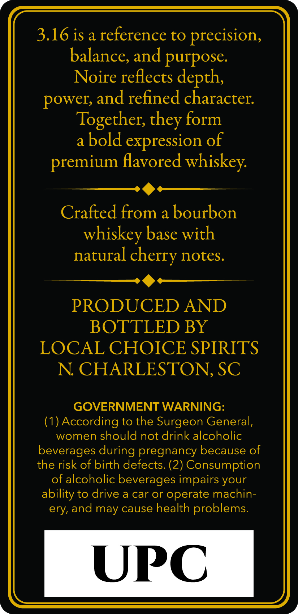
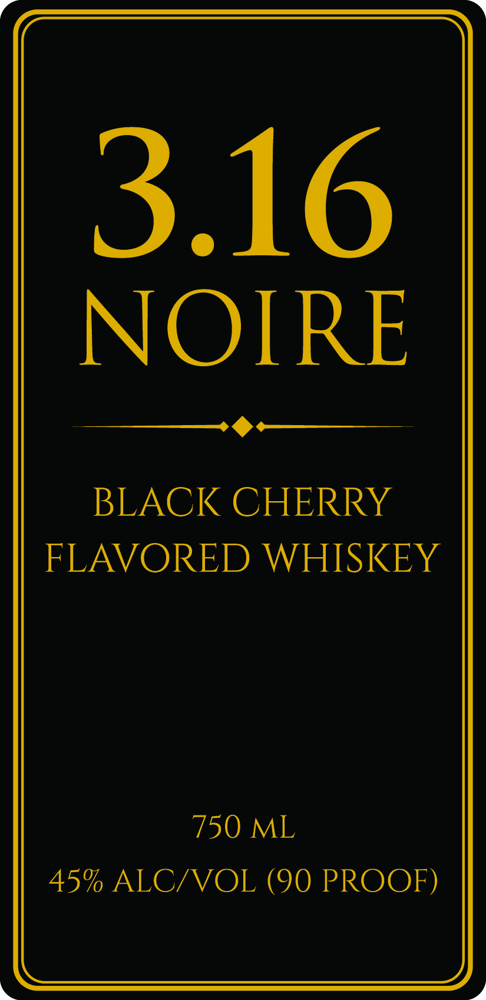

# TTB COLA Label Images - TTBID 26189001000706

**Brand Name:** 3.16 NOIRE

**Issue Date:** 07/14/2026

**Origin Code:** 41

**Product Class/Type:** 149

**Source:** [TTB Public COLA Registry](https://ttbonline.gov/colasonline/viewColaDetails.do?action=publicFormDisplay&ttbid=26189001000706)

## Label Images

### Back Label

### Front Label

## Extracted Label Text

*Text extracted via OCR - may contain errors*

**Detected Proof:** 90

### Back Label

3.16 is a reference to precision,
balance, and purpose.
Noire reflects depth,
power, and refined character.
Together, they form
a bold expression of
premium flavored whiskey.

SS)
Crafted from a bourbon
whiskey base with

natural cherry notes.
Sd

PRODUCED AND
BOTTLED BY
LOCAL CHOICE SPIRITS
N. CHARLESTON, SC

GOVERNMENT WARNING:

(1) According to the Surgeon General,
women should not drink alcoholic
beverages during pregnancy because of
the risk of birth defects. (2) Consumption
of alcoholic beverages impairs your
ability to drive a car or operate machin-
ery, and may cause health problems.

UPC

### Front Label

3.16
NOIRE
BLACK CHERRY
FLAVORED WHISKEY
750 ML
45% ALC/VOL (90 PROOF)
