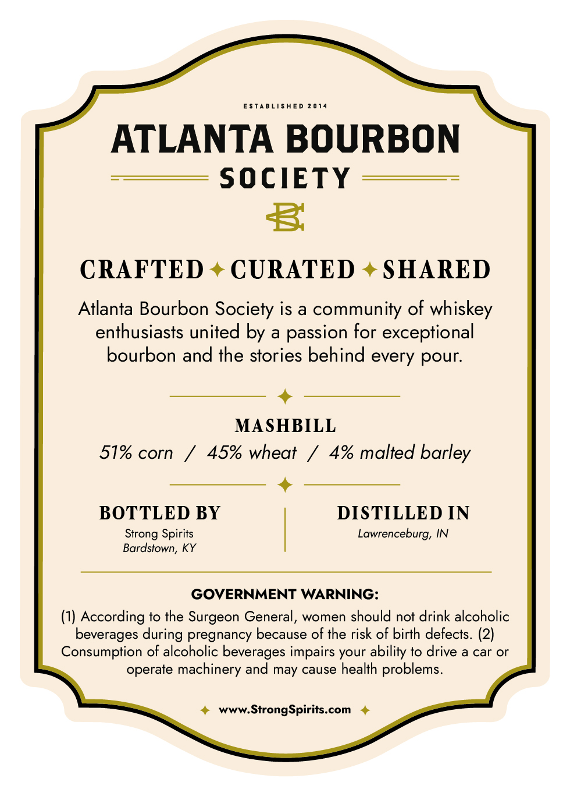
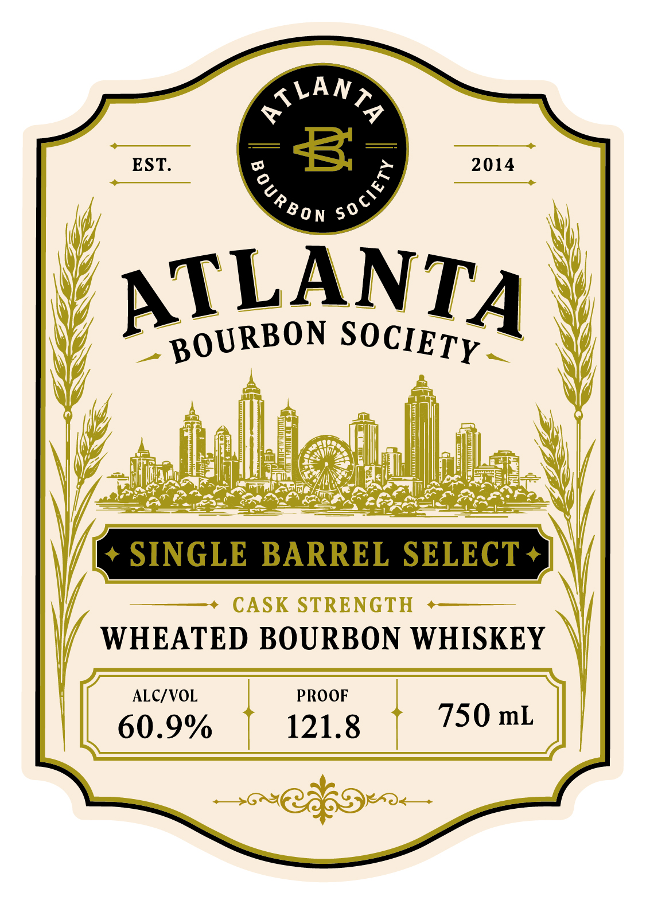

# TTB COLA Label Images - TTBID 26189001000766

**Brand Name:** ATLANTA BOURBON SOCIETY

**Issue Date:** 07/10/2026

**Origin Code:** 22

**Product Class/Type:** 141

**Source:** [TTB Public COLA Registry](https://ttbonline.gov/colasonline/viewColaDetails.do?action=publicFormDisplay&ttbid=26189001000766)

## Label Images

### Back Label

### Front Label

### Label 3

## Extracted Label Text

*Text extracted via OCR - may contain errors*

*1 image(s) excluded: text did not meet readability threshold*

**Detected Proof:** 121.8

### Back Label

ESTABLISHED 2 014
ATLANTA BOURBON
SOCIETY
3
CRAFTED
CURATED
SHARED
Atlanta Bourbon Society is a community of whiskey
enthusiasts united by a passion for exceptional
bourbon and the stories behind every pour:
MASHBILL
51% corn
45% wheat
4% malted barley
BOTTLED BY
DISTILLED IN
Spirits
Lawrenceburg, IN
Bardstown, KY
GOVERNMENT WARNING:
(1) According to the Surgeon General, women should not drink alcoholic
beverages during pregnancy because of the risk of birth defects. (2)
Consumption of alcoholic beverages impairs your ability to drive a car or
operate machinery and may cause health problems_
www.StrongSpirits.com
Strong

### Front Label

EST:
8
2014
ATLANTA
SINGLE
BARREL SELECT
CASK STRENGTH
WHEATED BOURBON WHISKEY
ALCIVOL
PROOF
60.9%
121.8
750 mL
ATLAN
2
1
OUR B0 N
BOURBON
SOCIETY
