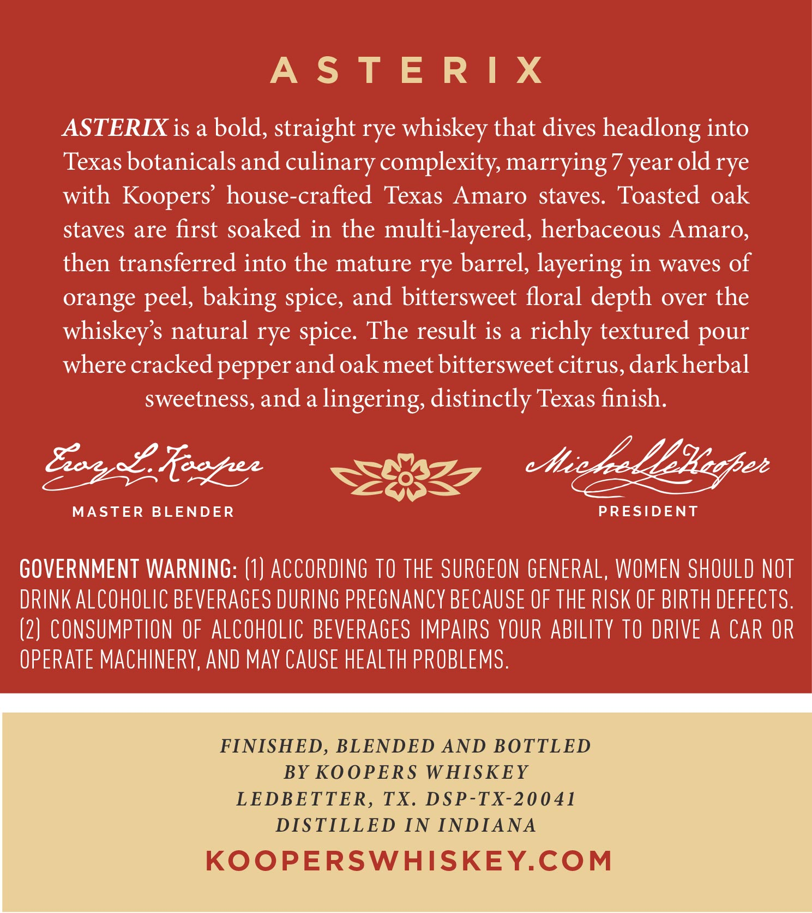
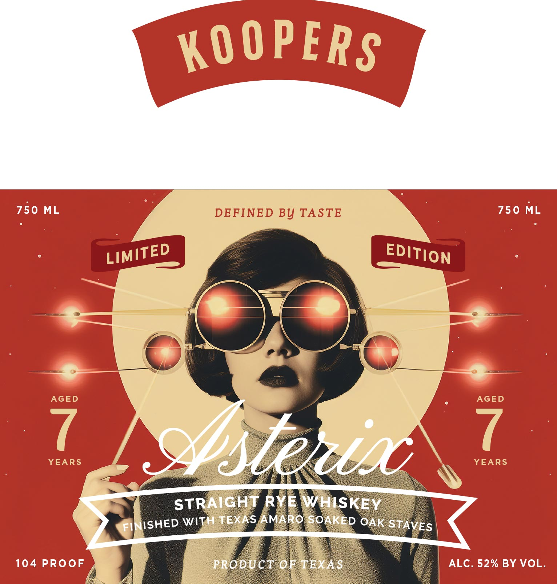

# TTB COLA Label Images - TTBID 26189001000826

**Brand Name:** KOOPERS

**Fanciful Name:** ASTERIX

**Issue Date:** 07/14/2026

**Origin Code:** 44

**Product Class/Type:** 102

**Source:** [TTB Public COLA Registry](https://ttbonline.gov/colasonline/viewColaDetails.do?action=publicFormDisplay&ttbid=26189001000826)

## Label Images

### Back Label

### Front Label

## Extracted Label Text

*Text extracted via OCR - may contain errors*

**Detected Proof:** 104
**Detected Age:** 7 Years

### Back Label

ASTERIX

ASTERIX is a bold, straight rye whiskey that dives headlong into

Texas botanicals and culinary complexity, marrying 7 year old rye

with Koopers’ house-crafted Texas Amaro staves. Toasted oak

staves are first soaked in the multi-layered, herbaceous Amaro,

then transferred into the mature rye barrel, layering in waves of

orange peel, baking spice, and bittersweet floral depth over the

whiskey’s natural rye spice. The result is a richly textured pour

where cracked pepper and oak meet bittersweet citrus, dark herbal

sweetness, and a lingering, distinctly Texas finish.
a Misteelllaliegper
Bogsi hegre SSUBZ
MASTER BLENDER PRESIDENT
GOVERNMENT WARNING: (1} ACCORDING TO THE SURGEON GENERAL, WOMEN SHOULD NOT
DRINK ALCOHOLIC BEVERAGES DURING PREGNANCY BECAUSE OF THE RISK OF BIRTH DEFECTS.
(2) CONSUMPTION OF ALCOHOLIC BEVERAGES IMPAIRS YOUR ABILITY TO DRIVE A CAR OR
OPERATE MACHINERY, AND MAY CAUSE HEALTH PROBLEMS.
FINISHED, BLENDED AND BOTTLED
BY KOOPERS WHISKEY
LEDBETTER, TX. DSP-TX-20041
DISTILLED IN INDIANA
KOOPERSWHISKEY.COM

### Front Label

KO 0PERS
750 ML
DEFINED BY TASTE
750 ML
AGED
AGED
YEARS
7
Ister $
YEARS
STRAIGHT RYE WHISKEY
FIM ISHED WITH TEXAS AMARO SOAKED OAK STAVES
104 PROoF
PRODUCT ORTEXAS
ALC. 52% BY VOL.
LIMITED
EDITION
