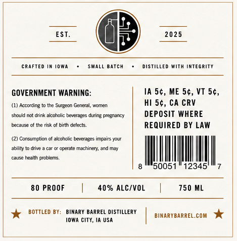
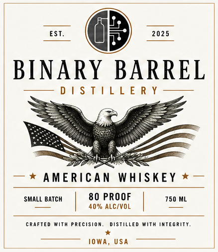

# TTB COLA Label Images - TTBID 26189001000913

**Brand Name:** BINARY BARREL

**Issue Date:** 07/10/2026

**Origin Code:** 20

**Product Class/Type:** 140

**Source:** [TTB Public COLA Registry](https://ttbonline.gov/colasonline/viewColaDetails.do?action=publicFormDisplay&ttbid=26189001000913)

## Label Images

### Back Label

### Front Label

## Extracted Label Text

*Text extracted via OCR - may contain errors*

**Detected Proof:** 80

### Back Label

EST.
20 25
cRafted im i0wA
SMALL Batch
Distilled With integrity
GOVERNMENT WARNING:
IA 56, ME 5c, VT 5c,
According
Surgean General, women
hi 5c, CA CRV
should not drink alcoholic beverages during pregnancy
DEPOSIT WHERE
tecause
the risk
birth defects_
REQUIRED BY LAW
Consumntian
alcoholic beverages
mpairs
Mout
ability
drive
ccerate
machinery
May
cause
health problents:
50051
12345
80 PROOF
40% ALC/VOL
750 ML
BOTTLED BY;
BINARY BARREL DISTILLERY
com
BINARYBARREL.
IOWA city, ia UsA

### Front Label

EST.
2025
BINARY BARREL
D | $ T | L L E R Y
AMERiCAN
WhiskEY
SMALL BATCH
80 PROOF
750 ML
40% ALC/VOL
cRAfTEd With
RECISiON_
DSTILLED
With integRity
IOWA, USA
