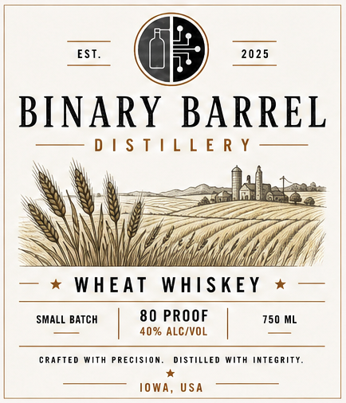

# TTB COLA Label Images - TTBID 26189001000915

**Brand Name:** BINARY BARREL

**Issue Date:** 07/10/2026

**Origin Code:** 20

**Product Class/Type:** 140

**Source:** [TTB Public COLA Registry](https://ttbonline.gov/colasonline/viewColaDetails.do?action=publicFormDisplay&ttbid=26189001000915)

## Label Images

### Front Label

## Extracted Label Text

*Text extracted via OCR - may contain errors*

**Detected Proof:** 80

### Front Label

—_

2025

BINA

RY BARREL

Some DPl Sale | Lal *E Re Y

|

la

posh

Via;

if

iy

— * WHEAT WHISKEY * —

80 PROOF

SMALL BATCH

40% ALC/VOL

750 ML

CRAFTED WITH PRECISION. DISTILLED WITH INTEGRITY.

IOWA, USA
