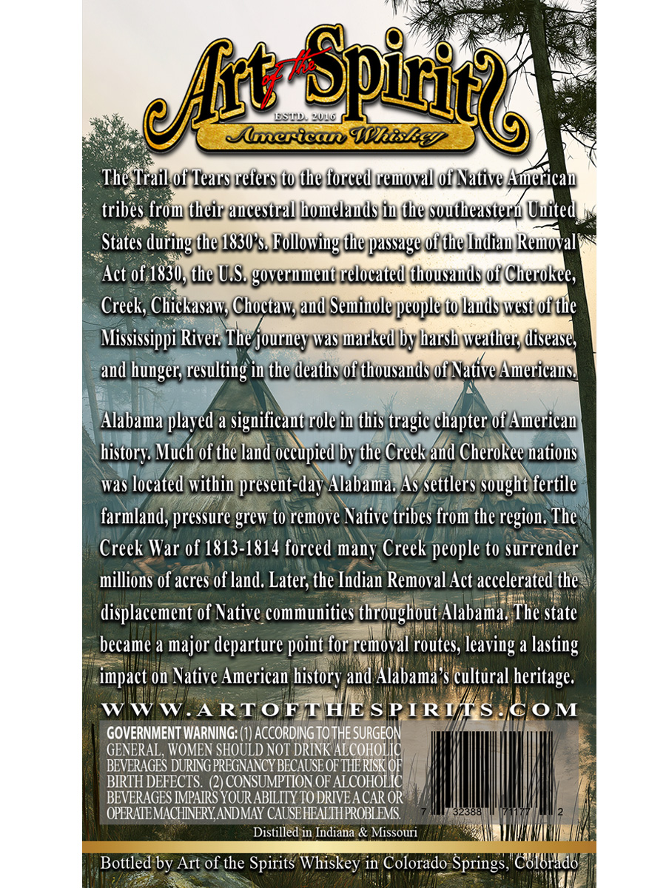
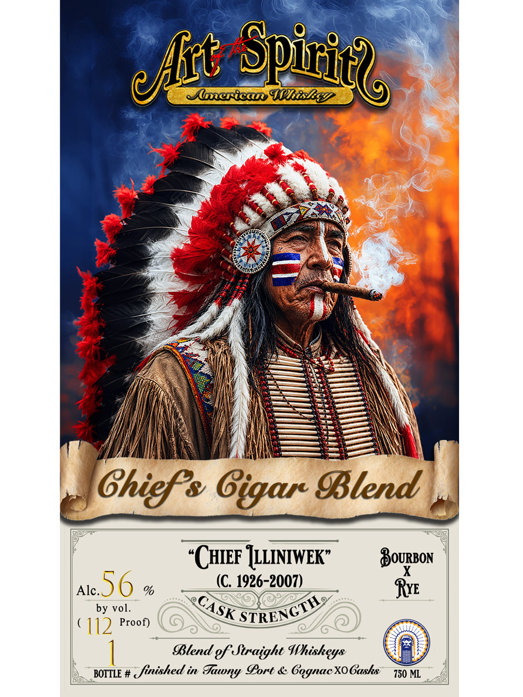

# TTB COLA Label Images - TTBID 26190001000019

**Brand Name:** ART OF THE SPIRITS AMERICAN WHISKEY

**Fanciful Name:** CHIEF ILLINIWEK

**Issue Date:** 07/22/2026

**Origin Code:** 13

**Product Class/Type:** 129

**Source:** [TTB Public COLA Registry](https://ttbonline.gov/colasonline/viewColaDetails.do?action=publicFormDisplay&ttbid=26190001000019)

## Label Images

### Back Label

### Front Label

## Extracted Label Text

*Text extracted via OCR - may contain errors*

**Detected Proof:** 112

### Back Label

ESl
Spiril2
249
Slmerica WhiskE?
The Trailof Tears refers to the forced remnoval 0f Native Americau
tribes from their aucestral lomelauds iu the southeasterw Uuited
States during the 1830s Following the ppassage of the udiau Rewoval
Act of,1830, the U,S. goverumeut relocated thousauds of Cherokee,
Creek, Chickasaw; Choctaw; aud Seminole people to lauds west oi the
Mississippi River: The journey Was marked by harsh weather; disease}
and
resulting in the deaths 0f thousauds 0f Native Americaust
Alabama plaved a
significaut role in this tragic chapter Of American
Much of the land occupied bv the Creek and Cherokee natious
was located within present-day Alabama; As settlers sought fertile
farmland, pressure grew to remove Native tribes from the region. The
Creek War 0f 1813-1814 forced many Creek people to surrender
millions of acres of land: Later; the Indian Removal Act accelerated the
displacement of Native communities throughout Alabama. The state
became a major departure
for removal routes;
a
lasting
impact on Native American
and Alabama $ cultural heritage.
WW
W.ARTOFT HEE S PIRU S
C0 M
GOVERNMENT WARNING: (1) ACCORDING TO THE SURGEON
GENERAL , WOMEN SHOULD NOT DRINK ALcoHolic
BEVERAGES DURING PREGNANCY BECAUSE OF
Aicofole
THERISK C
BIRTH DEFECTS.  (2) CONSUMPTION OF
BEVERAGES IMPAIRS YOUR ABILITY TO DRIVEA CAR OR
OPERAZEMACHNNERYANDMAY CAUSEHEALIHPROBLEMS
32388
Distilled in Indiana & Missouri
Bottled by Art of the Spirits Whiskey in Colorado
Springs, COIUlad8
efht
hunger; -
history;
point L
leaving =
history

### Front Label

MlericaIhisEEI
Ghiefs Gigar Blend
CHIEF IILINIWEK"
BoURBon
Alc_
56
%
(C 1926-2007)
Rye
by vol.
112 Proof)
Blend gf Straight Whisheys
BOTTLE #
~finished in
Sort & Gegnac XOGasks
750 ML
Spiic
elrt
CASK
STRENCTH
Juwny
