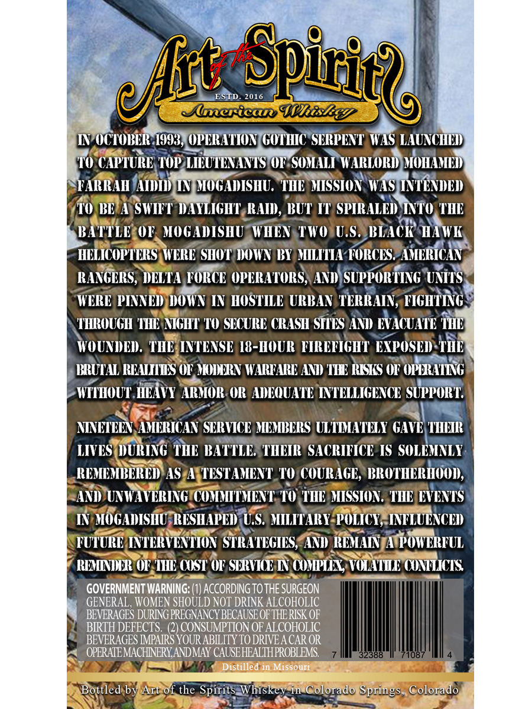
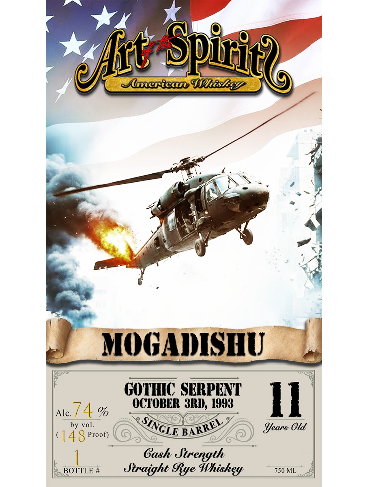

# TTB COLA Label Images - TTBID 26190001000020

**Brand Name:** ART OF THE SPIRITS AMERICAN WHISKEY

**Fanciful Name:** MOGADISHU

**Issue Date:** 07/10/2026

**Origin Code:** 13

**Product Class/Type:** 102

**Source:** [TTB Public COLA Registry](https://ttbonline.gov/colasonline/viewColaDetails.do?action=publicFormDisplay&ttbid=26190001000020)

## Label Images

### Back Label

### Front Label

## Extracted Label Text

*Text extracted via OCR - may contain errors*

**Detected Proof:** 148

### Back Label

f. daa Q _@) @€ \
‘| AS J | iT Y,
oe PS ’
FINOCTOBERI99SN OPERATION GOTHIC SERPENT * TLAUNCHE
vs at, a area)
0 CAPTURE, TOPALIEU! ENANTS MSONAITWARTOR MOHAMED
5 Lk NICHT TREE ATL bi yH
FARRAH SADE MOGADISHU. THE MISSION, WASSINTENDED
7 ~ 8. ba -
(TO BEFANSWIET DAYLIGHT, sRAID, BUT TT SPIRALED NT THE
BATTLEOR. MOGADISHUWHEN TWOUU.S) BUACK wi
~ Jo va Ya es wath,
HELICOPTERS WERE SHOT DOWN BY MILITIA-PORCESPAMERICAN
i < 4 a . . er
RANGERS, DELTA FORCE OPERATORS} AND)SUPPORTING UNITS
WERE PINNED DOWN IN HOSTILE URBAN TERRAIN, TIGHTING:
» A <=
\ THROUGH THE NIGHT TO SECURE CRASH SITES AND EVACUATE hip
at Ley
WOUNDED. THESINTENSE 18-HOUR FIREFIGHT EXPOSED-THE
BRUTAL READIES OF NODERN WARFARE AND THE RISKS OF OPERATING my
A is 5
WITHOUT, HEAVY ARMOR: OR ADEQUATE INTELLIGENCE SU PPOR T.
Pr ie. \Wa 8
NINETEENSAMERICAN SERVICE MEMBERS ULTIMATELY GAVELTHETE
ant aos ONE , >
LIVES DURING THE BATTLES THEIR’ SACRIFICE IS SOLEMNLY:
REMEMBERED) ASeASTESTAMENT_ TO/COURAGE, BROTHERHOOD,
SAND TUNWAVERINGECOMMIT MENT, 10 THE MISSION. THE EVENTS
IN MOGADISHUOPRESHAPED US. MILITARY. POLICYRINELUENCED
FUTURE INTERVENTION STRATEGIES MAND KEMATNpATP OWERFUL
F REMINDEROF. IH COST OF SHRVIGEIN COMPLEX, VOLATILE OONTLICTS.
GOVERNMENT WARNING: (1) ACCORDING TO THE SURGEON
GENERAL. WOMEN SHOULD NOT DRINK ALCOHOLIC
BEVERAGES DURING PREGNANCY BECAUSE OF THE RISK OF
BIRTH DERECHS LCOS JMPTION OF ALCOHOLIC
BEVERAGES IMP. ‘OUR ABILITY TO DRIVE A CAR OR
i-<_ OPERATEMACHINERY,AND MAY CAUSEHEALTH PROBLEMS. J
“4 ==) < Distilled in Missoun IT &
a oe i
BortledibypAreot the Spiritsaw hiskey-Mme@Oloradopsprinesy Golorad oJ
Ny) a le

### Front Label

~Spitic?
JlgricaIDhiSZey
MIOGADDISHU
GOUHVIC SLRPENT'
Alc.
74 %
OCIOBER 3181), 1993
II
by vol
Iears Old
148
Proof)
Gask Strength
BOTTLE #
Straight 9ye Whiskey
750 ML
Uft
SINGLE '
BARREL
