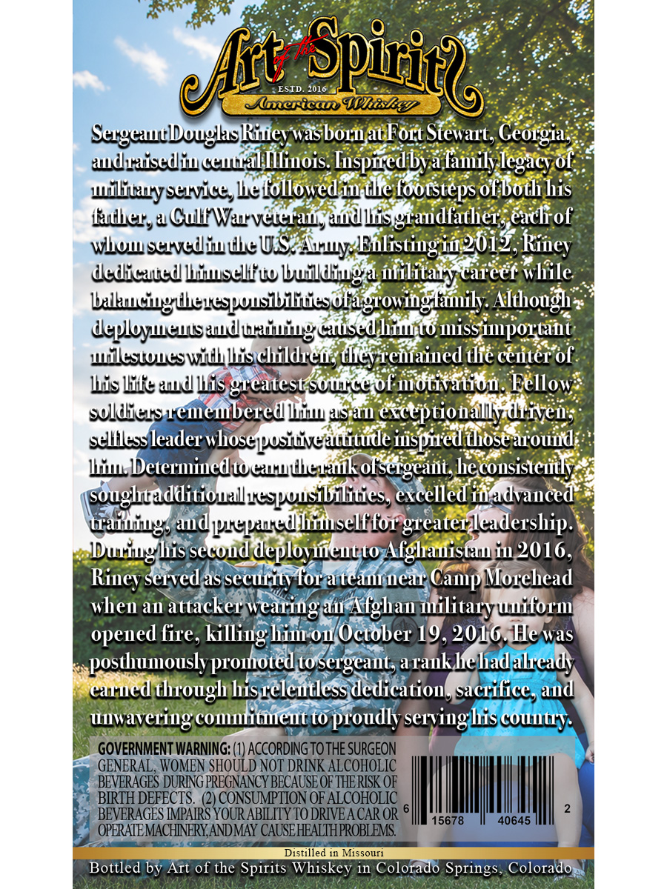
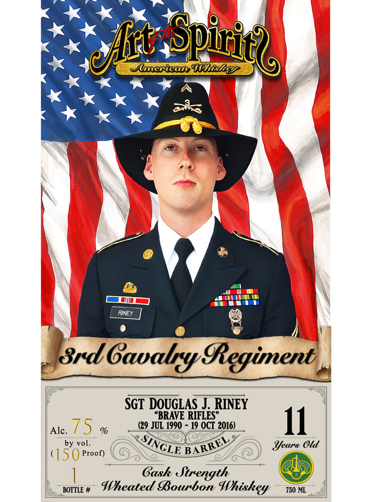

# TTB COLA Label Images - TTBID 26190001000023

**Brand Name:** ART OF THE SPIRITS AMERICAN WHISKEY

**Fanciful Name:** SGT DOUGLAS RINEY

**Issue Date:** 07/10/2026

**Origin Code:** 13

**Product Class/Type:** 141

**Source:** [TTB Public COLA Registry](https://ttbonline.gov/colasonline/viewColaDetails.do?action=publicFormDisplay&ttbid=26190001000023)

## Label Images

### Back Label

### Front Label

## Extracted Label Text

*Text extracted via OCR - may contain errors*

**Detected Proof:** 150

### Back Label

ESTD
~Spiric2e
2016
Mlerican 4hisEg
Sergeautleuglaskitey wasbornat Fort Stewart, Ceorgia;
audraisedliu euual Illinois: Iuspiredbva lamily
of
Wilituysewvice lelollowed iu Ule footstepsol both his
fadher, a CulfWarvelerawsaudlisgraudfather,eacli of
wowsevediuueUS Ty Eilistingin2oi2,
dedicaued hiuselltw builldiuga
careef wlile
balhuciuguieuspuusibilticsofagrowinglamily: Although
deplloyculsauduxiuingcauscd hiunto IissipOrtant
Wileswueswith lischildred; tllevremained tlie ceuter of
lis litte %udllis greatest soulte of mdtivation: Fellow;
selldiersueneubered liuu aSan exceptionallydriveu;
selllessleader whosepusiuiveauuitude iuspired thosearouud
li Determinedtocauuuerak otsergcaut heconsisteudy
soughtadditioualu-spousibilities,excelled iWadvanced
waiuiug; audptpautd hiuselffor greaterleadership.
Wuriughis secoud deplovueutto Afghauistaw in 2016,
Rinev served assecurity f0r a teauruear
Morehead
when an attacker wearing au Afghan
uilitaryuuitorm
opened
killing him oulOctober 19,2016,Hewas
posthumously promoted to sergcant,arank hehad alcady
earued though hisreleutless dedication,sacrifice, and
unwavering cOuitueut to proudly serviuglis couutry:
GOVERNMENT WARNING: (1) ACCoRdiNG TO THE SURGEON
GENERAL, WOMEN SHOULD NOT DRINK ALCOHOLIC
BEVERAGES DURING PREGNANCY BECAUSE OF THE RISK OF
BIRTH DEFECTS.  (2) CONSUMPTION OF ALCOHOLIC
BEVERAGES MPAIRS YOURABILITY TO DRIVEA CAR OR
15678
40645
OPERATEMACHNERYANDMAY CAUSEHEALTHPROBLEMS
Distilled in Missoufi
Bottled by Art of the Spirits Whiskey in Colorado Springs, Colorado
efht
legacy
Riney
wilitaly'
Camp
fire.

### Front Label

Spitit?
Mluerica WKisEEy
RINEY
8rd Gaaby GRegiment,
SGT DOUGLAS J RINEY
"BRAVE RIFLES"
Alc.
75
%
(29 JUL 1990
19 OCT 2016)
11
by vol_
Years Old
15 0 Proof)
Gask Strength
BOTTLE #
Wheated Bourbon
750 ML
efht
SINGLE
BARREL
Whiskey
