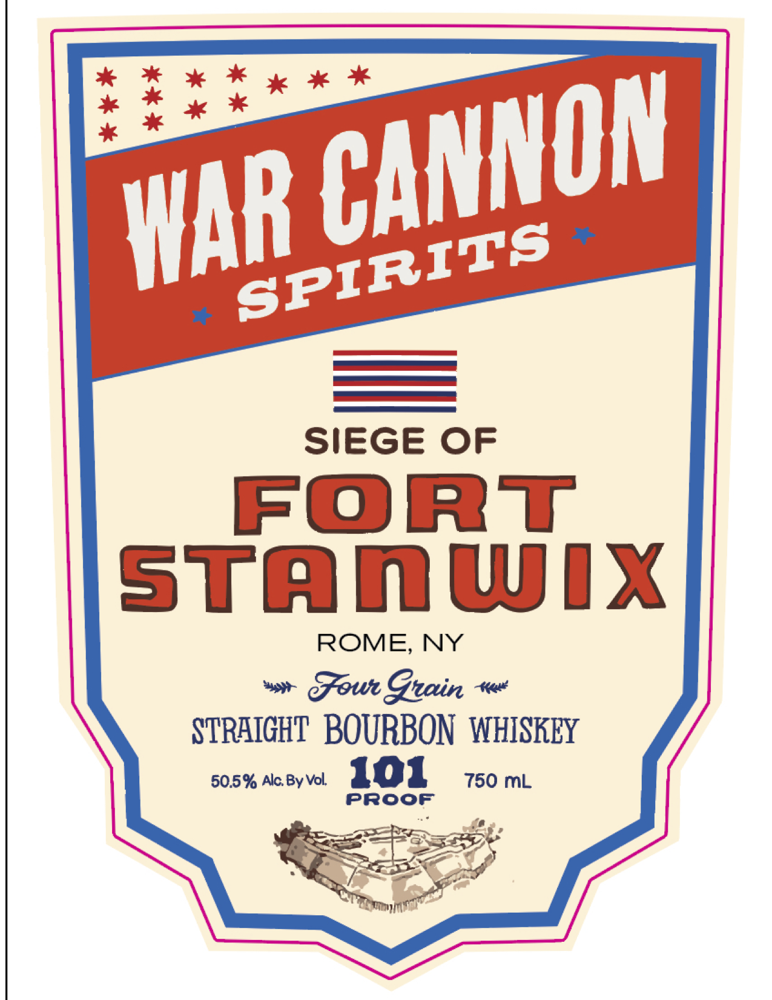
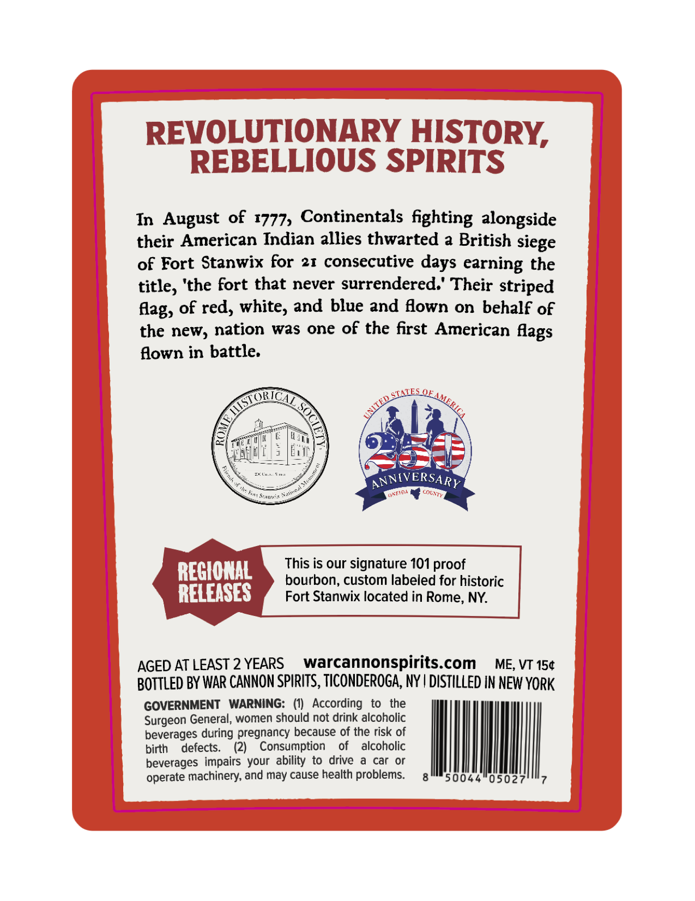

# TTB COLA Label Images - TTBID 26190001000270

**Brand Name:** WAR CANNON SPIRITS

**Fanciful Name:** SIEGE OF FORT STANWIX

**Issue Date:** 07/13/2026

**Origin Code:** 02

**Product Class/Type:** 101

**Source:** [TTB Public COLA Registry](https://ttbonline.gov/colasonline/viewColaDetails.do?action=publicFormDisplay&ttbid=26190001000270)

## Label Images

### Front Label

### Label 2

## Extracted Label Text

*Text extracted via OCR - may contain errors*

**Detected Proof:** 101
**Detected Age:** 2 Years

### Front Label

SIEGE
OF
FOrT
stamwix
ROME, NY
Gou Gtain
STRHIGHT  BOURBON  WHISKEY
50.5% Alc By Vol
101
750 mL
PRoof
CANNON
WAR
SPIRITS

### Label 2

REVOLUTIONARY HISTORY,
REBELLIOUS SPIRITS
In August of 1777, Continentals fighting alongside
their American Indian allies thwarted a British siege
of Fort Stanwix for
21 consecutive
days earning the
title; 'the fort that never surrendered:' Their striped
of red; white; and blue and flown on behalf of
the new, nation
was one of the first American
flown in battle:
QE
2
ANNIVERSARY
S'aunis
REGIONAL
This is our signature 101 proof
bourbon;, custom labeled for historic
RELEASES
Fort Stanwix located in Rome; NY:
AGED AT LEAST 2 YEARS
warcannonspirits com
ME; VT 154
BOTTLed BY WAR CANNON SPIRITS, TICONDEROGA, NY | DISTILLED IN NEW YORK
GOVERNMENT
WARNING:
(0)   According
to
the
Surgeon General, women should not drink alcoholic
beverages during pregnancy because of the risk of
birth
defects_
(2)
Consumption
of
alcoholic
beverages impairs your
to
drive
car
or
operate machinery, and may cause health problems.
50044
05027
Aag,
flags
SLNES
MuSTORZ
AMERICA
ED
3
MME
#neoA _
colxy
Kat
e
ability
