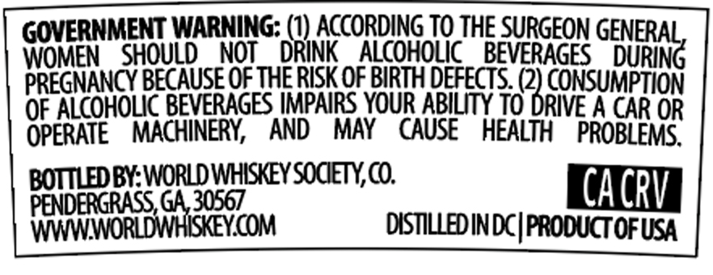
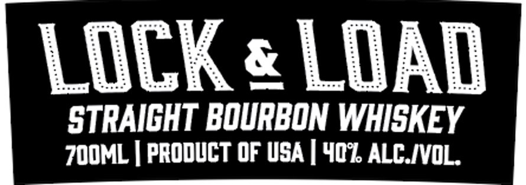

# TTB COLA Label Images - TTBID 26190001000384

**Brand Name:** LOCK & LOAD

**Issue Date:** 07/13/2026

**Origin Code:** 08

**Product Class/Type:** 101

**Source:** [TTB Public COLA Registry](https://ttbonline.gov/colasonline/viewColaDetails.do?action=publicFormDisplay&ttbid=26190001000384)

## Label Images

### Back Label

### Front Label

## Extracted Label Text

*Text extracted via OCR - may contain errors*

### Back Label

GOVERNMENT WARNING: (1) ACCORDING TO THE SURGEON GEN

WOMEN SHOULD NOT DRINK ALCOHOLIC BEVERAGES DURING
PREGNANCY BECAUSE OF THE RISK OF BIRTH DEFECTS. 0 CONSUMPTION
OF ALCOHOLIC BEVERAGES IMPAIRS YOUR ABILITY TO DRIVE A CAR OR
OPERATE MACHINERY, AND MAY CAUSE HEALTH PROBLEMS.
BOTTLED BY: WORLD WHISKEY SOCIETY, CO. | CACRY |
chi ci
Www) COM DISTILLED INDC| PRODUCT OF USA

### Front Label

LOCK e LOAD
STRAICHT BOURBON WHISKEY
70OML | PRODUCT OF USA | 401 ALC IVOL
