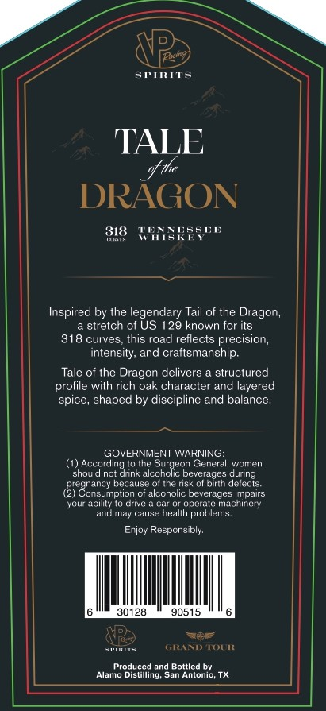
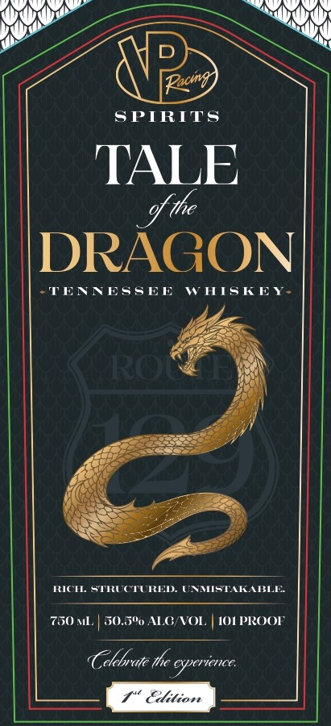

# TTB COLA Label Images - TTBID 26190001000387

**Brand Name:** TALE OF THE DRAGON

**Issue Date:** 07/13/2026

**Origin Code:** 44

**Product Class/Type:** 140

**Source:** [TTB Public COLA Registry](https://ttbonline.gov/colasonline/viewColaDetails.do?action=publicFormDisplay&ttbid=26190001000387)

## Label Images

### Back Label

### Front Label

## Extracted Label Text

*Text extracted via OCR - may contain errors*

### Back Label

STmTs
TALE
DRAGON
818
71G
ER"
Inspired by the legendary Tail of the Dragon,
stretch of US
29 known for its
318 curves
this road reflects precision,
intensity, and craftsmanship
Tale of the Dragon delivers
structured
profile with rich oak character and layered
spice, shaped by discipline and balance
GOVERNMENT WARNING:
(1) Accordling
Surgeon General, women
should not drink alcoholic beverages during
regnanc" because
the risk ol birth deiecls:
(2) Consumption of alccholic beverages impairs
ycur ability I0 drive
dderaie
machinery
anc may cause nealth problems.
Erjoy Responsibly:
30128
90515
Rel7
Aona
GiliNI) Iui{
Produced
Bottled by
Tamo Distiiling
Antonio

### Front Label

Ro
SPIRITS
TALE
DRAGON
TENRESSEE
WHISKEY
ROI
KIC STRLCTURED. UAMISTALE
750
GO
ALC VOL
10I PROOI'
Celebrate the cxperience:
Elition
% ihe
5"o
l,
