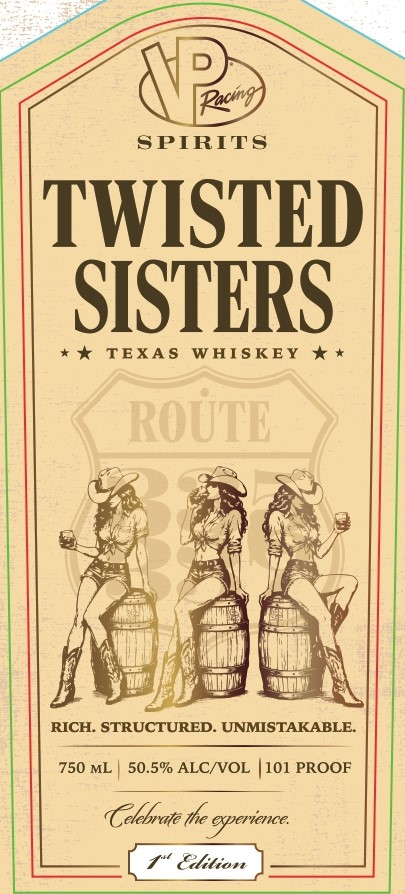
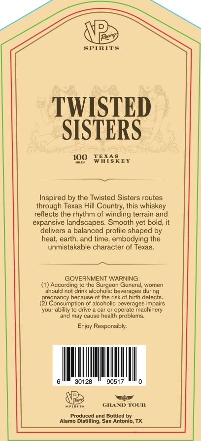

# TTB COLA Label Images - TTBID 26190001000396

**Brand Name:** TWISTED SISTERS

**Issue Date:** 07/13/2026

**Origin Code:** 44

**Product Class/Type:** 140

**Source:** [TTB Public COLA Registry](https://ttbonline.gov/colasonline/viewColaDetails.do?action=publicFormDisplay&ttbid=26190001000396)

## Label Images

### Front Label

### Label 2

## Extracted Label Text

*Text extracted via OCR - may contain errors*

**Detected Proof:** 101

### Front Label

D
[Pochg
SPIRITS
TWISTED
SISTERS
TEXA $
WAIS KEY
* *
ROUTE
RICH. STRUCTURED_
UNMISTAKABLE
750 ML
50.5% ALCNVOL
101 PROOF
Celebrate the oxperience
Elition

### Label 2

VR
SPIRITS
TWISTED
SISTERS
I@0 WmAREY
Inspired by the Twisted Sisters routes
through Texas Hill Country; this whiskey
retlects the rhythm of winding terrain
expansive landscapes
Smooth yet bold, it
delivers
balanced profile shaped by
heat; earth; and time, embodying the
unmistakable character of Texas:
GOVERNMENT WARNING:
According
the Surgeon General, women
should not drink alcoholic beverages during
pregnancy because of the risk of birth defects:
Consumption=
alcoholic beverages impairs
Voui
ability to drive
car 5
operate machinery
and may cause health
problems
Enjoy Responsibly:
30128
90517
GRAND TOUR
produceo
and Bottled by
Alamo Distilling; San Antonio; TX
and
