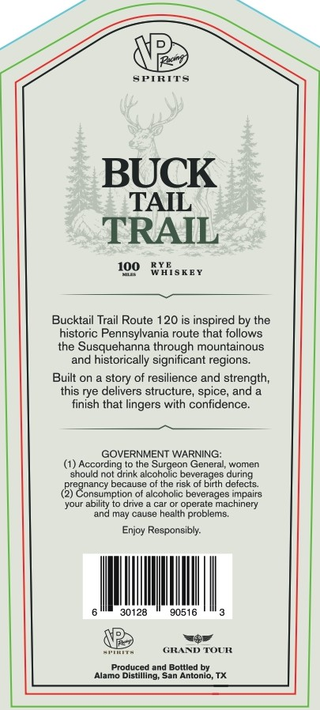
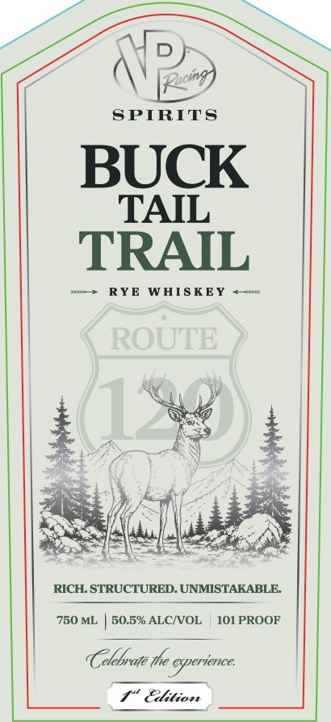

# TTB COLA Label Images - TTBID 26190001000400

**Brand Name:** BUCK TAIL TRAIL

**Issue Date:** 07/13/2026

**Origin Code:** 44

**Product Class/Type:** 142

**Source:** [TTB Public COLA Registry](https://ttbonline.gov/colasonline/viewColaDetails.do?action=publicFormDisplay&ttbid=26190001000400)

## Label Images

### Back Label

### Front Label

## Extracted Label Text

*Text extracted via OCR - may contain errors*

**Detected Proof:** 101

### Back Label

He
SPIRTTS
BUCK
TAIL
TRAIL
100
WXisKEY
Bucktail Trail Route 120 is inspired by the
historic Pennsylvania route that follows
the Susquehanna through mountainous
and historically
significant regions:
Built on
of resilience and strength;
this rye delivers structure , spice, and
finish that lingers with confidence
GOVERNMENT WARNING:
According to the Surgeon General; women
should not drink alcoholic beverages during
pregnancy because of the rsk of birth detects_
Consumption of alcoholic beverages impairs
your ability to drive
car or operate
machinery
and may cause health problems.
Enjoy Responsibly:
30128
90516
GRAND TOUR
Produced and Bottled by
Alamo Distilling; San
Antonio; TX
story

### Front Label

D
[Pecin
SPIRITS
BUCK
TAIL
TRAIL
RYE WHIS KEY
ROUTE
RICH. STRUCTURED: UNMISTAKABLE:
750 ML
50.5% ALCIVOL
101 PROOF
elebrate the experience:
Elition
