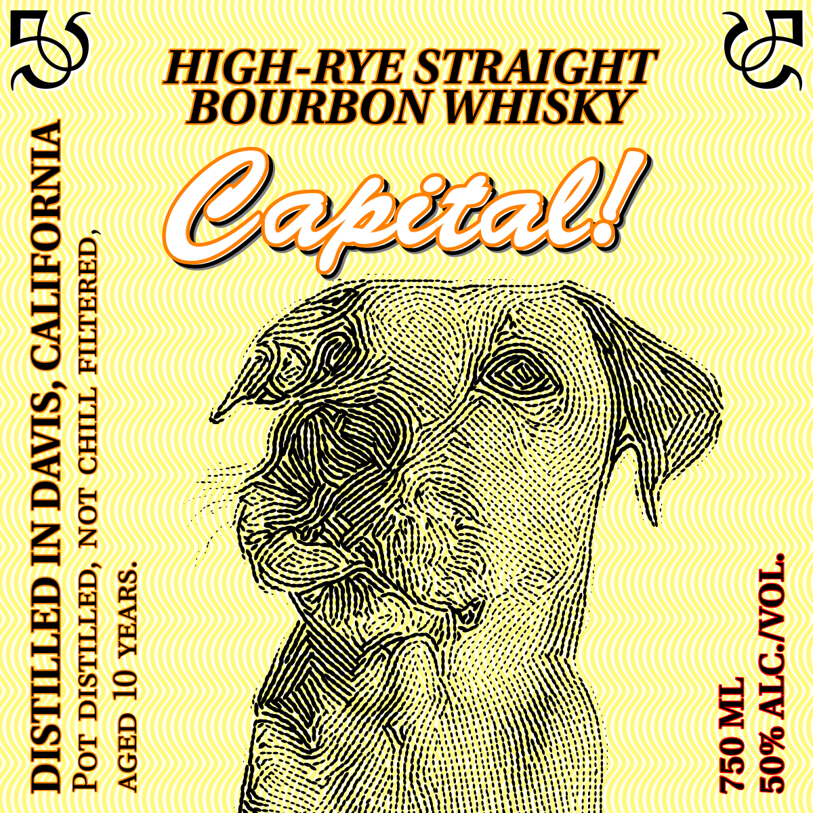
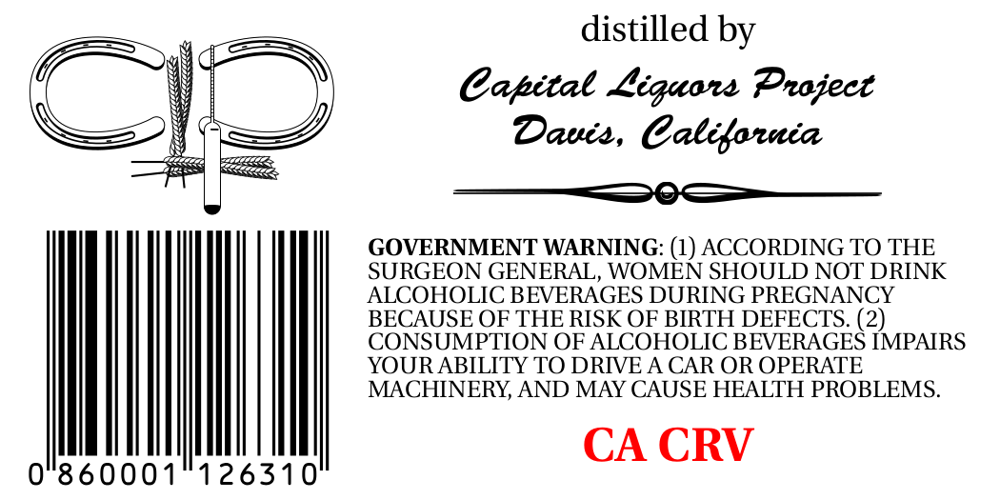

# TTB COLA Label Images - TTBID 26190001000406

**Brand Name:** CAPITAL

**Issue Date:** 07/13/2026

**Origin Code:** 01

**Product Class/Type:** 101

**Source:** [TTB Public COLA Registry](https://ttbonline.gov/colasonline/viewColaDetails.do?action=publicFormDisplay&ttbid=26190001000406)

## Label Images

### Label 1

### Label 2

## Extracted Label Text

*Text extracted via OCR - may contain errors*

### Label 1

Sg

HIGH-RYE STRAIGHT
BOURBON WHISKY

S)

“SUVHA QT GHDV
‘Gaua Id THHO LON ‘GaTILLSIA LOg

VINYOAITVO ‘SIAVG NI GATILLSIG

### Label 2

distilled by
Cabital Liquar Praject
Dauis , Calilarnia
GOVERNMENT WARNING: (1) ACCORDING TO THE
SURGEON GENERAL, WOMEN SHOULD NOT DRINK
ALCOHOLIC BEVERAGES DURING PREGNANCY
BECAUSE OF THE RISK OF BIRTH DEFECTS. (2)
CONSUMPTION OF ALCOHOLIC BEVERAGES IMPAIRS
YOURABILITY TO DRIVE A CAR OR OPERATE
MACHINERY; AND MAY CAUSE HEALTH PROBLEMS.
CA CRV
0"860001
126310
