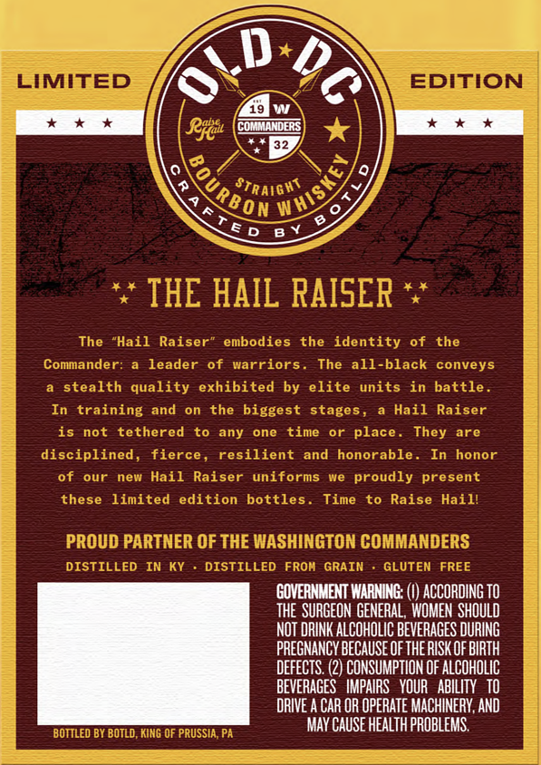
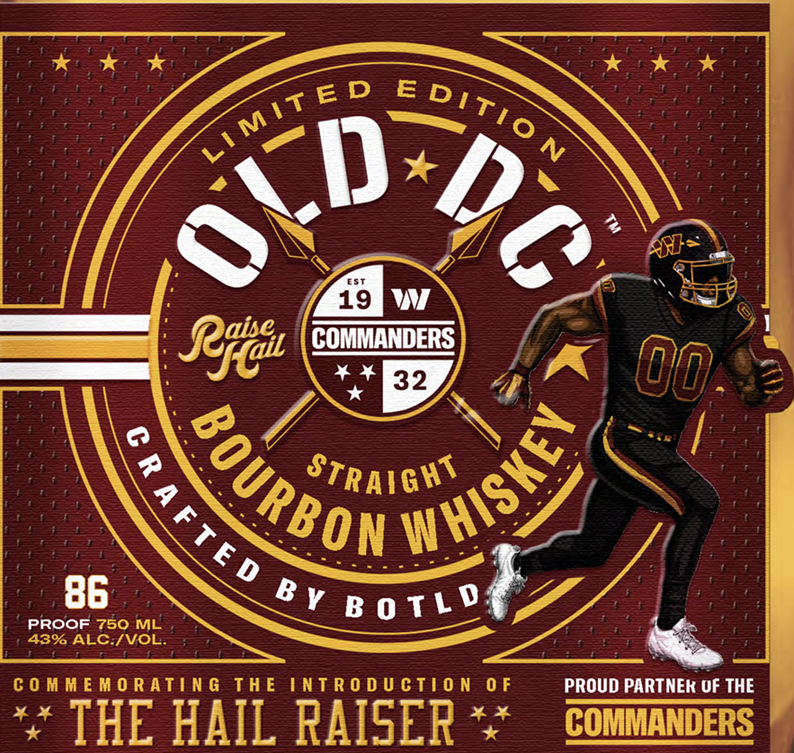

# TTB COLA Label Images - TTBID 26190001000426

**Brand Name:** OLD DC

**Issue Date:** 07/13/2026

**Origin Code:** 39

**Product Class/Type:** 101

**Source:** [TTB Public COLA Registry](https://ttbonline.gov/colasonline/viewColaDetails.do?action=publicFormDisplay&ttbid=26190001000426)

## Label Images

### Back Label

### Front Label

## Extracted Label Text

*Text extracted via OCR - may contain errors*

**Detected Proof:** 86

### Back Label

LIMITED
EDITION
Rftaul
COMMANDERS
Straight
6 D
THE HAIL RAISER
The
"Hail
Raiser
embodies
the identity
of
the
Commander:
leader
of
warriors.
The all-black
conveys
stealth quality
exhibited by elite
units in battle
In training and
on the
biggest stages ,
Hail
Raiser
is
not
tethered
to
any
one
time
or
place . They
are
disciplined, fierce ,
resilient
and
honorable .
honor
of
our
new Hail
Raiser
uniforms
we
proudly present
these
limited
edition bottles .
Time
to Raise Haill
PROUD PARTNER OF THE WASHINGTON COMMANDERS
DISTILLED
IN Ky
DISTILLED
FROH
GRAIN
GLUTEN FREE
GOVERNMENT WARNING: (I) ACCORDING TO
the SURGEON GENERAL, WOMEN  ShOULD
NOT DRINK ALCOHOLIC BEVERAGES DURING
PREGNANCY BECAUSE OF THE RISK OF BIRTH
DEFECTS: (2) CONSUMPTION OF ALCOHOLIC
BEVERAGES   IMPAIRS   YOUR   ABILITY   TO
DRIVE A CAR OR OPERATE MACHINERY, AND
MAY CAUSe health PROBLEMS
BOTTLED BY BOTLD , KING OF PRUSSIA, PA
WHISKEY
#OURBO@
B Y

### Front Label

1
CI
2
19
Regtal
COMMANDERS
(0Jo
32
STRAIGHT
86
Bv B 0 TL 0
PROOF 750 ML
43% ALC IVOL
C 0 M M E M0 Ratin G
Th E
IntR 0 d U CTi0 N
0 F
PROUD PARTNEK UF THE
4 *
THE HAIL RAISER
COMMANDERS
EditiO
MiTED
WHISKEV
BOURBON
2
A FTE D
