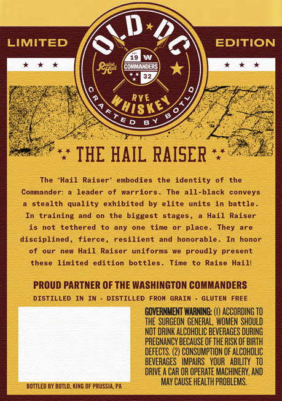
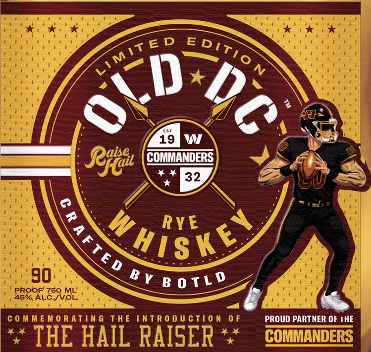

# TTB COLA Label Images - TTBID 26190001000431

**Brand Name:** OLD DC

**Issue Date:** 07/13/2026

**Origin Code:** 39

**Product Class/Type:** 142

**Source:** [TTB Public COLA Registry](https://ttbonline.gov/colasonline/viewColaDetails.do?action=publicFormDisplay&ttbid=26190001000431)

## Label Images

### Back Label

### Front Label

## Extracted Label Text

*Text extracted via OCR - may contain errors*

**Detected Proof:** 90

### Back Label

D
LIMITED
EDITION
Rjti
cOLMAMDERS
RVE
'HiSKE
ED
THE HAIL RAISER
The
'Hail
Raiser
embodies
the identity
the
Comniander:
leader
of warriors
The all-black
conveys
stealth quality
exhibited
elite units
battle
In training
and
the biggest stages,
Hail
Raiser
is not
tethered
any
one
time
place
They
disciplined, fierce
resilient and honorable _
honor
ouI
new Hail
Raiser
uniforms
proudly
present
these
limited
edition bottles .
Time
Raise Haill
PROUD PARTNER OF THE WASHINGTON COMMANDERS
DISTILLED IN
DISTILLED FROA GRAIN
GLUTEN FREE
GOVERNMENT WARNING: (U) ACCORDING TO
the SURGEON GENERAL,  WOMEM ShOULD
NOT DRINK ALCOHOLIC BEVERAGES OURING
PREGMANCY beCaUSE OF THE RISK OF BIRTH
DEFECTS, (2) CONSUMPTION OF ALCOHOLIC
BEVERACES   IMPAIRS   YOUR   ABILITY   TO
DRIVE A CAR OR Operate MAChINERY, AND
May CAUSE HEALTH PROBLEMS.
BOTTLEd BY BOTLO, KIRG QF PRUSSIA PA

### Front Label

19
Retat
COMMANDERS
4 4
32
RY E
90
BV 8 0 T L p
PROOF 750 ML
45% ALC-IVOL
C 0 M M E Mo R ating ThE intR 0 d U Ction 0 F
PROUD PARTNER OF IHE
THE HAIL RAISER
COMMANDERS
MiT ED
Editio
1
Whisks
