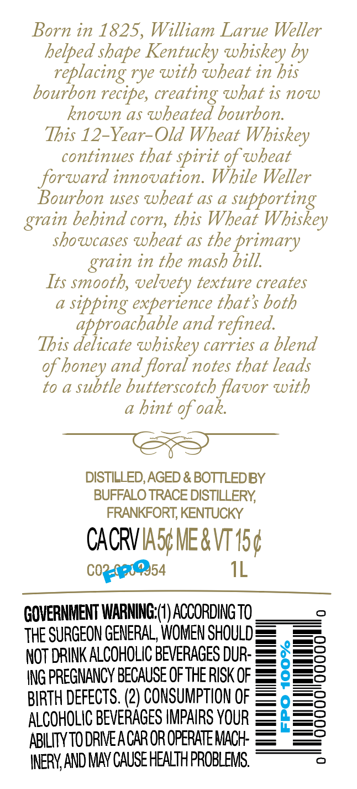

# TTB COLA Label Images - TTBID 26190001000451

**Brand Name:** WELLER

**Issue Date:** 07/13/2026

**Origin Code:** 22

**Product Class/Type:** 109

**Source:** [TTB Public COLA Registry](https://ttbonline.gov/colasonline/viewColaDetails.do?action=publicFormDisplay&ttbid=26190001000451)

## Label Images

### Back Label

### Front Label

## Extracted Label Text

*Text extracted via OCR - may contain errors*

**Detected Proof:** 90
**Detected Age:** 12 Years

### Back Label

Born in 1825, William Larue Weller
helped shape Kentucky whiskey by
replacing rye with wheat in his
bourbon recipe,
what is now
known as wheated bourbon.
This 12-Year-Old Wheat Whiskey
continues that
of wheat
forward innovation. While Weller
Bourbon uses wheat as a
supporting
behind corn, this Wheat
Whiskey
showcases wheat as the primary
in the mash bill.
Its smooth, velvety texture creates
sipping experience thats both
approachable and refined
This delicate whiskey carries a blend
of honey and floral notes that leads
to a subtle butterscotch flavor with
hint of oak.
DISTILLED, AGED & BOTTLEDBY
BUFFALO TRACE DISTILLERY
FRANKFORT; KENTUCKY
CACRVIASUME&V 15p
C0?_
54
1L
GOVERNMENT WARNING (I) ACCORDING TO _
THE SURGEON GENERAL, WOMEN SHOULD
NOT DRINK ALCOHOLIC BEVERAGES DUR-
ING PREGNANCY BECAUSE OFTHE RISK OF
1
BIRTH DEFECTS. (2) CONSUMPTION OF
ALCOHOLIC BEVERAGeS IMPAIRS YOUR
2
ABILITYTO DRIEACAR OR OPERATEMACH:
INERYAND MAY CAUSE HEALTH PROBLEMS:
creating
spirit
grain
grain
Feq

### Front Label

seller
AGED
12
YEARS
KENTUCKY STRAIGHT
WHEAT WHISKEY
1L
450 ALCIVOL
90 PROOF
