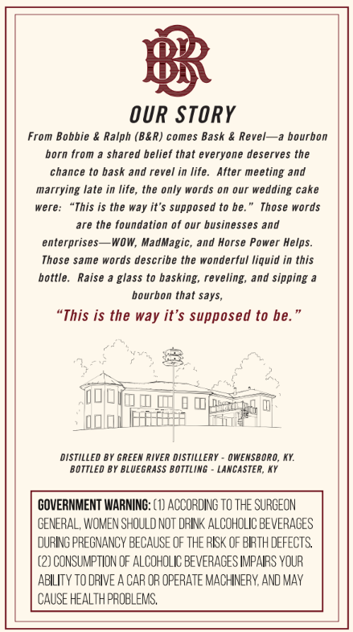
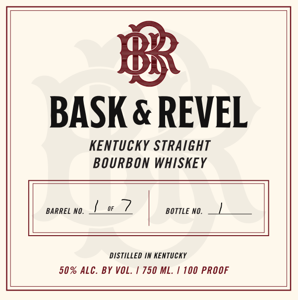
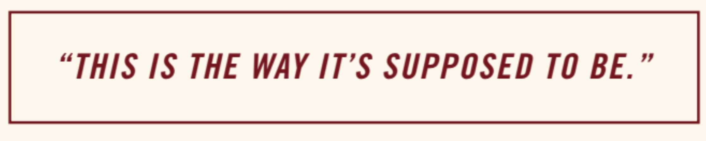
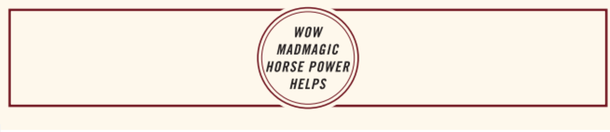

# TTB COLA Label Images - TTBID 26190001000487

**Brand Name:** BASK & REVEL

**Issue Date:** 07/13/2026

**Origin Code:** 22

**Product Class/Type:** 101

**Source:** [TTB Public COLA Registry](https://ttbonline.gov/colasonline/viewColaDetails.do?action=publicFormDisplay&ttbid=26190001000487)

## Label Images

### Back Label

### Front Label

### Label 3

### Label 4

## Extracted Label Text

*Text extracted via OCR - may contain errors*

*1 image(s) excluded: text did not meet readability threshold*

**Detected Proof:** 100

### Back Label

B3
OUR STORY
From Bobbie & Ralph (B&R) comes Bask & Revel_~a bourbon
born
shared belief that everyone deserves the
chance to bask and revel in life.
After meeting and
marrying late in life, the only words 0n our wedding cake
were:
is the way it"$ supposed to be:
Those words
are the foundation of our businesses and
enterprises-
WOW, MadMagic,
and Horse Power Helps:
Those same words describe the wonderful liquid in this
bottle:
Raise
glass to basking; reveling; and sipping
bourbon that says,
"This is the way it'$ supposed to be:
DISTILLED BY GREEN RIVER DISTILLERY
OWENSBORO, KK:
BOTTLED BY BLUEGRASS BoTTLiNG
LancaSTER; Ky
GOVERNMENT WARNING: (1) ACCORDING tO The SURGEON
CENERAL, WOMEN SHOULD NOT dRIK ALCOHOLIC BEVERAGES
DuRING PREGNANCY BECAUSE OF THE RISK OF BRTH DEFECTS
(2) CONSUMPTION OF Alcoholic Beverages IMPAIRS VOUR
ABILITY TO DRIVE A CAR OR OPERATE MACHINERY, AND MAY
CAUSE HEalth proBLeMS,
from
"This

### Front Label

BASK & REVEL
KENTUCKY StRAiGHT
BOURBON WHISKEY
BARREL NO.
BOTTLE NO.
DISTiLLEd IN KEnTUCKY
50% ALC. BY VOL:
750 ML;
100 PROOF

### Label 4

wow

MADMAGIC

HORSE POWER

HELPS
