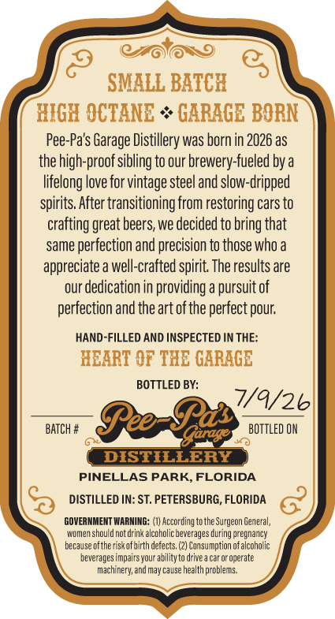
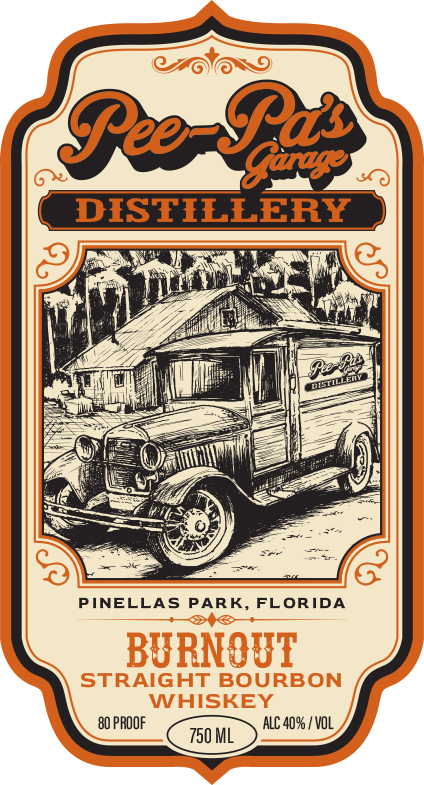

# TTB COLA Label Images - TTBID 26190001000676

**Brand Name:** PEE-PA'S GARAGE DISTILLERY

**Issue Date:** 07/22/2026

**Origin Code:** 16

**Product Class/Type:** 101

**Source:** [TTB Public COLA Registry](https://ttbonline.gov/colasonline/viewColaDetails.do?action=publicFormDisplay&ttbid=26190001000676)

## Label Images

### Back Label

### Label 1

## Extracted Label Text

*Text extracted via OCR - may contain errors*

**Detected Proof:** 80

### Back Label

SMALL BATCH
HIGK OCTANE
GARAGE BORN
Pee-Pa's Garage Distillery was born in 2026 as
the high-proof sibling to our brewery-fueled by a
lifelong love for vintage steel and slow-dripped
spirits. After transitioning from restoring cars to
crafting great beers; we decided to bring that
same perfection and precision to those who a
appreciate a well-crafted spirit The results are
our dedication in providing
pursuit of
perfection and the art ofthe perfect pour;
HANd-FILLED AND INSPECTED IN THE:
REART €F THE GARAGE
BOTTLED BY:
7/9/26
BATCH #
BeBza
BOTTLed ON
DISTILLERY
PINELLAS PARK,FLORIDA
DISTILLED IN: ST, PETERSBURG, FLORIDA
GOVERNME HT VIARNINGE
According to the Surgeon General;
Woner should not drink alcoholic beverages during pcegnancy
because ofthe riscofhirth defects, (2) Consumption ofalcoholic
beverages impairs your abilidy to drive a car or operate
machinery; and may cause health problems

### Label 1

BeB)
DISTILLERY
PINELLAS
PARK
FLORIDA
BURNOUT
STRAIGHT BOURBON
WHISKEY
80 PROOF
ALC 40%5 / VoL
750 ML
Hu
