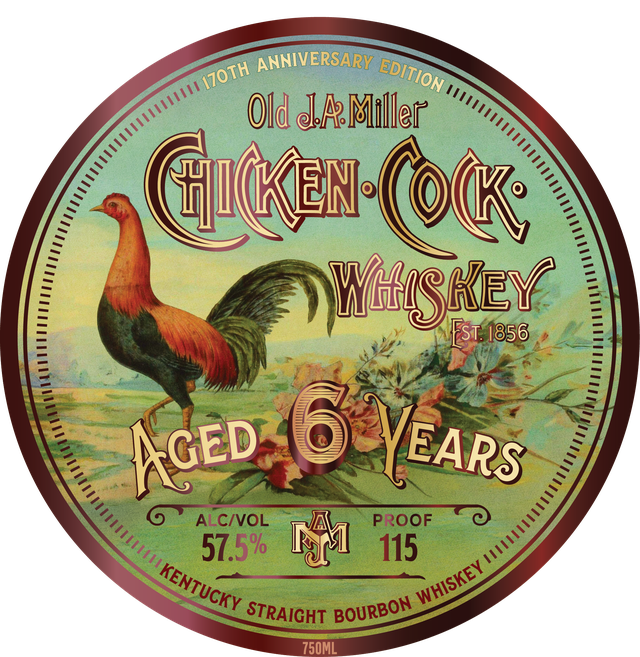
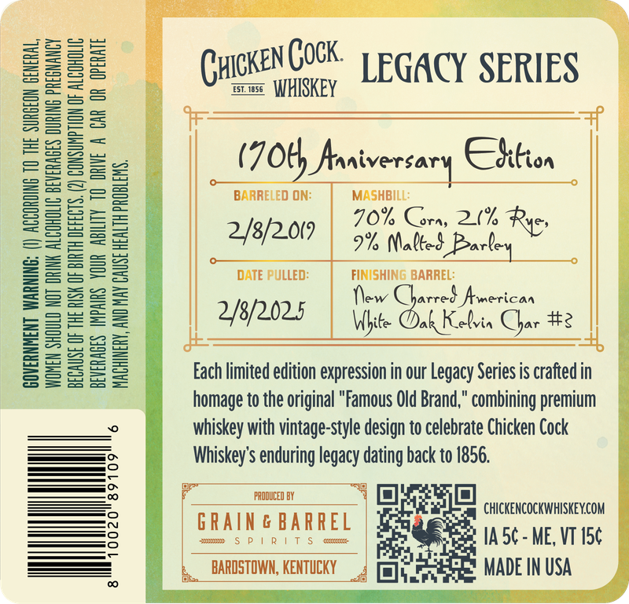
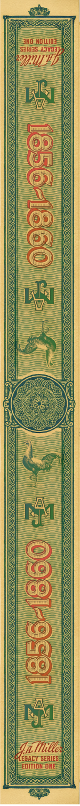

# TTB COLA Label Images - TTBID 26190001000734

**Brand Name:** CHICKEN COCK

**Issue Date:** 07/17/2026

**Origin Code:** 35

**Product Class/Type:** 101

**Source:** [TTB Public COLA Registry](https://ttbonline.gov/colasonline/viewColaDetails.do?action=publicFormDisplay&ttbid=26190001000734)

## Label Images

### Label 1

### Label 2

### Label 3

## Extracted Label Text

*Text extracted via OCR - may contain errors*

**Detected Proof:** 115

### Label 1

ANNIVERSARY
Old @AMller
Gucen @okK;
Wglsiey
1856
Aced
ALCIVOL
PROOF
57.5%
115
STRAIGHT
750ML
EDITION,
IZOTH
VEARS
WHISKEY
KENTUCKY
BOURBON

### Label 2

(HicKENCOCK. | GACY SERIES

was WHISKEY

iz
_ (70th Aaaiversary Chition

BARRELED ON: MASHBILL:

C BEVERAGES DURING PREGNANCY
CONSUMPTION OF ALCOHOLIC
TY 10 ORIVE A CAR OR OPERATE

o

GOVERNMENT WARNING: (I) ACCORDING TO THE SURGEON GENERAL,

= = 70% Corn, 21h Rye,
EEE 248/207 | 5% Matted ey

= = = 2 : DATE PULLED: ‘ite inary

Safe Ypy20ns | DLAC a2
———
s = =2 Each limited edition expression in our Legacy Series is crafted in

homage to the original "Famous Old Brand,” combining premium
whiskey with vintage-style design to celebrate Chicken Cock

°

ie Whiskey's enduring legacy dating back to 1856.
: f BR A | Tarn R R E L i ray z CHICKENCOCKWHISKEY.COM
—== L,_BARDSTOWN, KENTUCKY 4 ]eeEE MADEIN USA

8

### Label 3

JNpNoIq}
571435 1J17p37
@M1Hb
0
8
Ma huille
EGACY SERIES
editiq oone
