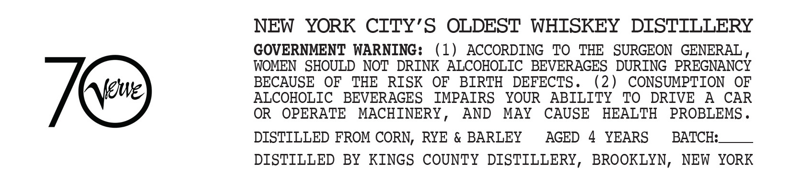
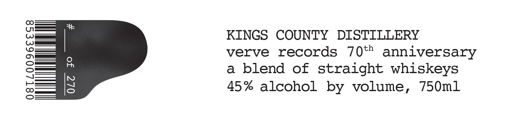

# TTB COLA Label Images - TTBID 26190001000779

**Brand Name:** KINGS COUNTY DISTILLERY

**Issue Date:** 07/17/2026

**Origin Code:** 02

**Product Class/Type:** 129

**Source:** [TTB Public COLA Registry](https://ttbonline.gov/colasonline/viewColaDetails.do?action=publicFormDisplay&ttbid=26190001000779)

## Label Images

### Back Label

### Front Label

## Extracted Label Text

*Text extracted via OCR - may contain errors*

**Detected Proof:** 90
**Detected Age:** 4 Years

### Back Label

NEW
YORK CITY'S OLDEST WHISKEY
DISTTLLERY
GOVERNMENT WARNING:
(1)
ACCORDING
TO
THE   SURGEON
GENERAL
WOMEN   SHOULD NOT DRINK ALCOHOLIC
BEVERAGES   DURING PREGNANCY
BECAUSE
OF
THE
RISK
OF
BIRTH
DEFECTS .
(2)
CONSUMPTION
OF
Meue)
ALCOHOLIC
BEVERAGES
IMPAIRS
YOUR
ABILITY
TO
DRIVE
A
CAR
OR
OPERATE
MACHINERY_
AND
MAY
CAUSE
HEALTH
PROBLEMS _
DISTILLED FROM CORN, RYE & BARLEY
AGED
4
YEARS
BATCH:
DISTILLED BY KINGS
COUNTY DISTILLERY,
BROOKLYN,
NEW  YORK

### Front Label

KINGS COUNTY DISTILLERY

verve records 70*" anniversary

a blend of straight whiskeys

45% alcohol by volume, 750ml
