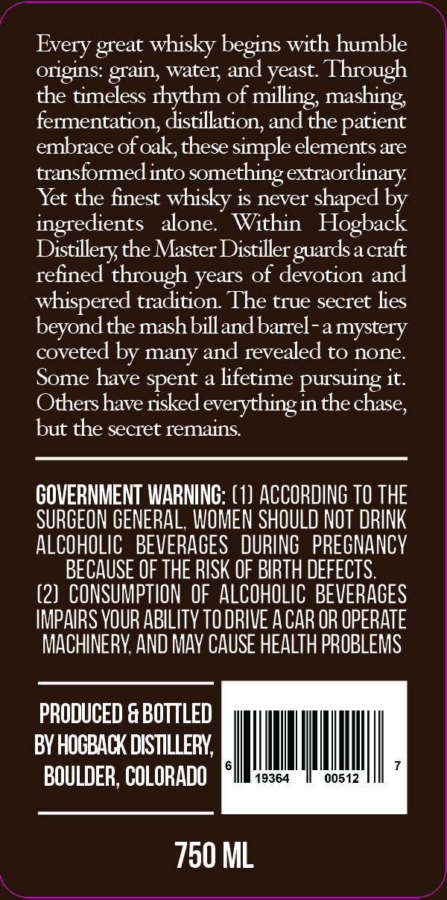
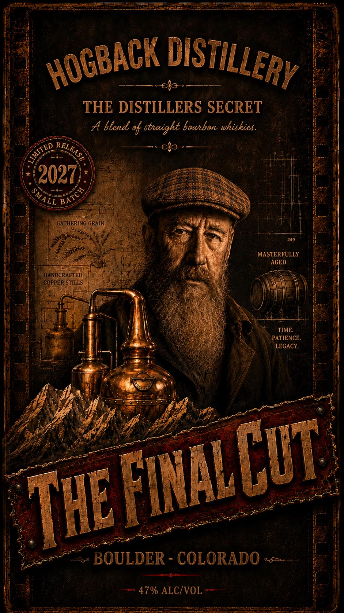

# TTB COLA Label Images - TTBID 26190001000861

**Brand Name:** HOGBACK DISTILLERY

**Fanciful Name:** THE FINAL CUT

**Issue Date:** 07/16/2026

**Origin Code:** 13

**Product Class/Type:** 121

**Source:** [TTB Public COLA Registry](https://ttbonline.gov/colasonline/viewColaDetails.do?action=publicFormDisplay&ttbid=26190001000861)

## Label Images

### Back Label

### Label 1

## Extracted Label Text

*Text extracted via OCR - may contain errors*

*1 image(s) excluded: text did not meet readability threshold*

### Back Label

whisky begins with humble
origins: grain; water; and yeast Through
the timeless rhythm of milling; mashing
fermentation; distillation; and the patient
embrace of oak,these simple elements are
transformed into something extraordinary
Yet the finest whisky is never shaped
ingredients
alone
Within
Distillery the Master Distiller
a craft
refined through years of devotion and
whispered tradition The true secret lies
beyondthe mash billandbarrel-amystery
coveted by many and revealed to none
Some have spent a lifetime pursuing it.
Othershave risked everythingin the chase,
but the secret remains:
GOVERNMENT WARNING: (1) ACCORDING TO THE
SURGEON GENERAL, WOMEN SHOULD NOT DRINK
ALCOHOLIC   BEVERAGES
DURING   PREGNANCY
BECAUSE OF THE RISK OF BIRTH DEFECTS
(2] CONSUMPTION  OF ALCOHOLIC BEVERAGES
IMPAIRS VOUR ABILITV TO DRIVE A CAR OR OPERATE
MACHINERY AND MAV CAUSE HEALTH PROBLEMS
PRODUCED & BOTTLED
BY HOOBACK DISTILLERY;
BOULDER, COLORADO
19364
00512
750 ML
Every
great
Hogtaatk
guards =
