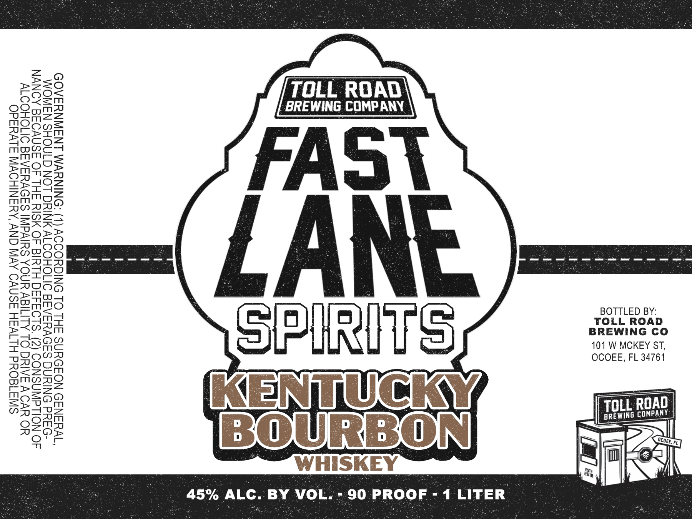

# TTB COLA Label Images - TTBID 26190001000886

**Brand Name:** FAST LANE SPIRITS

**Fanciful Name:** KENTUCKY BOURBON WHISKEY

**Issue Date:** 07/16/2026

**Origin Code:** 16

**Product Class/Type:** 141

**Source:** [TTB Public COLA Registry](https://ttbonline.gov/colasonline/viewColaDetails.do?action=publicFormDisplay&ttbid=26190001000886)

## Label Images

### Label 1

## Extracted Label Text

*Text extracted via OCR - may contain errors*

**Detected Proof:** 90

### Label 1

BOTTLED BY:
TOLL ROAD
BREWING CO
101 W MCKEY ST,
OCOEE, FL 34761

DAD
[ Hou. Rao

TOLL ROAD

BREWING COMPANY

|
ee
=
|

GOVERNMENT ee 1) ACCORDING TO THE SURGEON GENERAL,
WOMEN SHOULD NOT RIN VALCOROLIC BEVERAGES DURING PREG-
NANCY BECAUSE OF THE RISK OF BIRTH Bete ) CONSUMPTION OF
ALCOHOLIC BEVERAGES IMPAIRS YOUR ABILITY TO DRIVE A CAR OR
OPERATE MACHINERY, AND MAY CAUSE HEALTH PROBLEMS

4 LITER

- 90 PROOF

BY VOL.

ALC

45%
