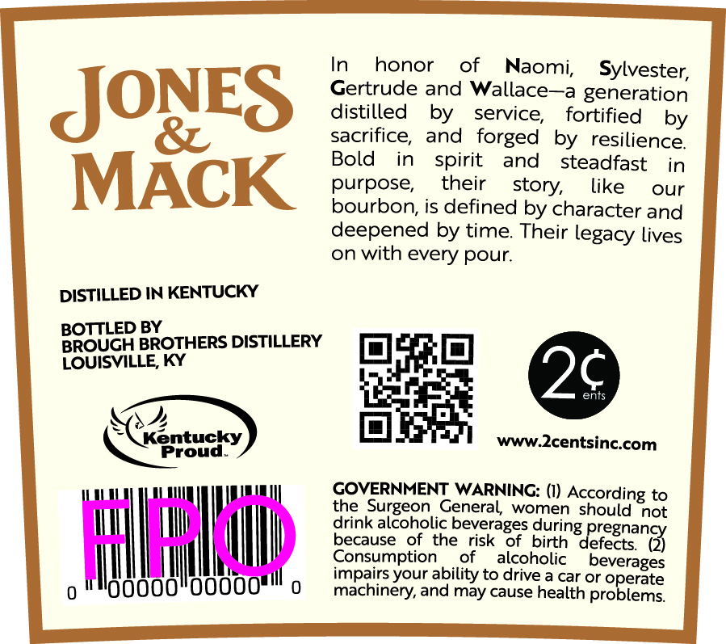
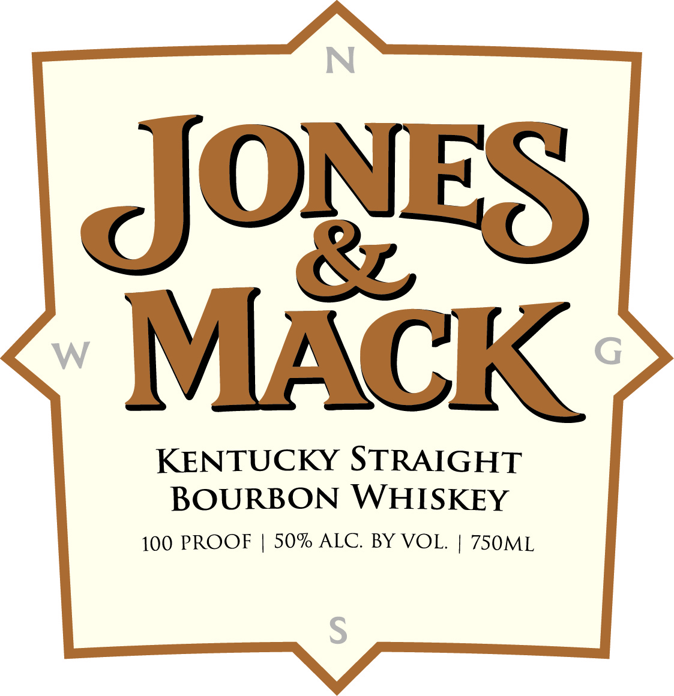

# TTB COLA Label Images - TTBID 26190001000903

**Brand Name:** JONES & MACK

**Fanciful Name:** KENTUCKY BOURBON

**Issue Date:** 07/13/2026

**Origin Code:** 22

**Product Class/Type:** 101

**Source:** [TTB Public COLA Registry](https://ttbonline.gov/colasonline/viewColaDetails.do?action=publicFormDisplay&ttbid=26190001000903)

## Label Images

### Back Label

### Front Label

## Extracted Label Text

*Text extracted via OCR - may contain errors*

**Detected Proof:** 100

### Back Label

In
honor
of
Naomi;
Sylvester;
Gertrude and
Wallace
generation
JONES
distilled
by
service;
fortified
by
sacrifice,
and forged
by   resilience
Bold
in
spirit
steadfast
in
MACK
bolpose,
their
like
our
is defined by character and
deepened by time
Their
lives
on with every pour:
DISTILLED IN KENTUCKY
BOTTLED BY
BROUGH BROTHERS DISTILLERY
LOUISVILLE, KY
2c
ents
Kentucky
www Zcentsinccom
Proud
COVERNMENT WARNING: (I) According to
the Surgeon General women should not
drink alcoholic beverages during
Ha
because
ofthe
risk
OT
birth
defects;
eregnangy
Consumption
Ot
alcoholic
beverages
impairs your ability to drive a car or operate
machinery, and may cause health problems
and
story;
legacy

### Front Label

JONES
&
MACK
KENTUCKY STRAIGHT
BOURBON WHISKEY
100 PROOF
50% ALC.
BY VOL
750ML
