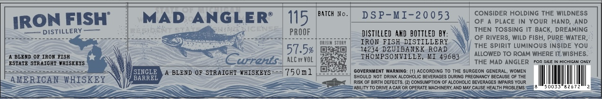

# TTB COLA Label Images - TTBID 26191001000029

**Brand Name:** MAD ANGLER

**Issue Date:** 07/15/2026

**Origin Code:** 06

**Product Class/Type:** 129

**Source:** [TTB Public COLA Registry](https://ttbonline.gov/colasonline/viewColaDetails.do?action=publicFormDisplay&ttbid=26191001000029)

## Label Images

### Label 1

## Extracted Label Text

*Text extracted via OCR - may contain errors*

**Detected Proof:** 115

### Label 1

BATCH
No_
D S P-MI-20053
CONSIDER HOLDING THE WILDNESS
FISH
MAD
ANGLER?
115
OF
PLACE
IN Your HanD
AND
DISTILLERY
PROOF
DISTILLED AND BOTTLED BY
THEN TOSSING IT BACK, DREAMING
OF RIVERS, WILd FiSh, PURE WATER,
ORISIA StORY
IRON FISH DISTILLERY
THE SpiRIT LUMINOUS INSIDE YoU
57.5%
14234 DZUISANEK RoAD
BLEAD 0F IROR FISH
THOSPSONVILLE,
Ki
49683
ALLOWED TO ROAM WHERE IT WISHES.
ESTATE STR AICHT #HISKEYS
grents
ALC ey VOL
THE MAD ANGLER
IHIGAN CNLT
SINGLE
BLEND 0? STRAIGHT "HISKEYS
750n1
GOVERNMENT MaRNING
AccORding T0 The SURGEON GENERAL
WOMEN
AMERICAN WHISKEY
BARREL
SHOULD Not Orink AlcOhOLiC BEVERAGES DuRING PREGNANCY BECAUSE OF THE
RISk OF BIRTH DEFECTS: (2) CONSUMPTION OF ALCOHOLIc BEVERACES IMIPAIRS YOUR
=
ABILITY TO DRIVE A CAR OR OPERATE MACHINERY, AND MAY CAUSE HEALTH PROBLEMS:
IRON
