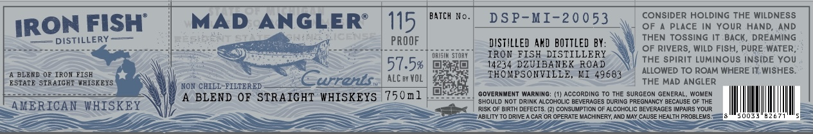

# TTB COLA Label Images - TTBID 26191001000030

**Brand Name:** MAD ANGLER

**Issue Date:** 07/15/2026

**Origin Code:** 06

**Product Class/Type:** 129

**Source:** [TTB Public COLA Registry](https://ttbonline.gov/colasonline/viewColaDetails.do?action=publicFormDisplay&ttbid=26191001000030)

## Label Images

### Label 1

## Extracted Label Text

*Text extracted via OCR - may contain errors*

**Detected Proof:** 115

### Label 1

FISH"
MAD
ANGLER
115
BATcH
D S P-MI-20053
CONSIDER HOLDING THE WILDNESS
IRON
OF
PLACE In Your HaND; AnD
DISTILLERY
'
PROOF
DISTILLED 4ND   BOTTLED BY:
THEN TOSSING IT  BACK ,
DREAMING
FiSH
OF RIVERS, WILD FISH, PURE WATER
0rISIR Story
IRON
DISTILLERY
THE Spirit LUMinOUS INSIde YoU
57.5%
14234 DZJISANEK
ROAD
ALLOWED TO ROAM WHERE IT WISHES.
BLERD 0F IRON FISH
ALC ey VOL
THOHPSONVILLE_
KI 4968}
ESTATE STRAICHT #HISKEYS
NON CHILL-FILTERED
cwrrents
THE MAD ANGLER
BLEND OF STRAIGHT WHISKEYS
750n1
GovernMent WARNING
According To ThE SURGEON GENERAL
WOMEN
SHOULD NOT DRINK ALCOHOLIC BEVERAGES DURING PREGNAKCY BECAUSE OF THE
AMERICAN WHISKEY
Risk OF BIRTH DEFECTS: (2) CONSUMPTION OF ALCOHOLIC BEVERAGES IMPAIRS YOUR
ABILITY TO DRIVE A CAR OR OPERATE MACHINERY, AND MAY CAUSE HEALTH PROBLEMS:
