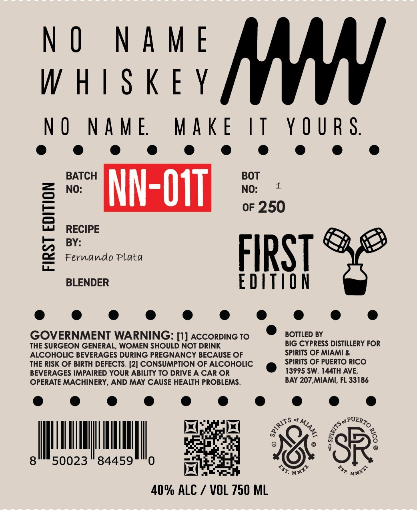

# TTB COLA Label Images - TTBID 26191001000066

**Brand Name:** NO NAME WHISKEY

**Issue Date:** 07/13/2026

**Origin Code:** 16

**Product Class/Type:** 140

**Source:** [TTB Public COLA Registry](https://ttbonline.gov/colasonline/viewColaDetails.do?action=publicFormDisplay&ttbid=26191001000066)

## Label Images

### Label 1

## Extracted Label Text

*Text extracted via OCR - may contain errors*

### Label 1

NO NAME
WHISKEY
NO NAME WAKE IT YOURS.

= = NN- O11

RECIPE
BY:

Fernando Plata

BLENDER EDITION

GOVERNMENT WARNING: [1] accorpinc To © somepey

THE SURGEON GENERAL, WOMEN SHOULD NOT DRINK BIG CYPRESS DISTILLERY FOR
ALCOHOLIC BEVERAGES DURING PREGNANCY BECAUSE OF SPIRITS OF MIAMI &

THE RISK OF BIRTH DEFECTS. [2] CONSUMPTION OF ALCOHOLIC e SPIRITS OF PUERTO RICO
BEVERAGES IMPAIRED YOUR ABILITY TO DRIVE A CAR OR 13995 SW. 144TH AVE,
OPERATE MACHINERY, AND MAY CAUSE HEALTH PROBLEMS. BAY 207,MIAMI, FL 33186

got POERD,
50023" 84459

FIRST Enon

os of oe

os
x
oot

‘s
nat”

40% he / VOL 750 ML
