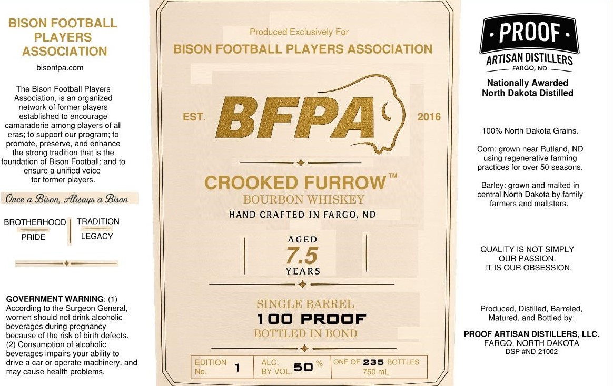

# TTB COLA Label Images - TTBID 26191001000084

**Brand Name:** CROOKED FURROW

**Fanciful Name:** BISON FOOTBALL PLAYERS ASSOCIATION

**Issue Date:** 07/14/2026

**Origin Code:** 36

**Product Class/Type:** 111

**Source:** [TTB Public COLA Registry](https://ttbonline.gov/colasonline/viewColaDetails.do?action=publicFormDisplay&ttbid=26191001000084)

## Label Images

### Label 1

## Extracted Label Text

*Text extracted via OCR - may contain errors*

**Detected Proof:** 100

### Label 1

BISON FOOTBALL
PLAYERS
Produced
Exclusively For
PROOF
ASSOCIATION
BISON FOOTBALL PLAYERS ASSOCIATION
DISTILLERS
bisonfpa com
FARGO,ND
Nationally Awarded
The Bison Football Players
North Dakota Distilled
Association;
is an organized
network of former players
established to encourage
EST
BFPA
2016
camaraderie among players of all
100% North Dakota Grains_
eras
to support our program; to
promote
preserve
and enhance
the strong tradition that is the
Corn: grown near Rutland
ND
foundation of Bison Foolball; and to
using regenerative farming
ensure
unified voice
practices for over 50 seasons
for former players_
CROOKED FURROW
Barley: grown and malted in
Once & Bison Alsays a Bison
BOURBON WHISKEY
central North Dakota by family
farmers and maltsters
HAND CRAFTED IN FARGO, ND
BROTHERHOOD
TRADITION
PRIDE
LEGACY
AGED
QUALITY IS NOT SIMPLY
7.5
OUR PASSION,
YEARS
IT IS OUR OBSESSION.
GOVERNMENT WARNING=
According to the Surgeon General,
SINGLE BARREL
Produced, Distilled
Barreled,
women should not drink alcoholic
100
PROOF
Matured, and Bottled by:
beverages during pregnancy
because of the risk of birth defects _
BOTTLED IN BOND
PROOF ARTISAN DISTILLERS, LLC;
Consumption of alcoholic
FARGO, NORTH DAKOTA
beverages impairs your abilily to
DSP #ND-21002
drive
car or operate machinery, and
EDITION
ALC
ONE OF 235 BOTTLES
may cause health problems
No
BY VOL.50
750 mL
ARTISAN
