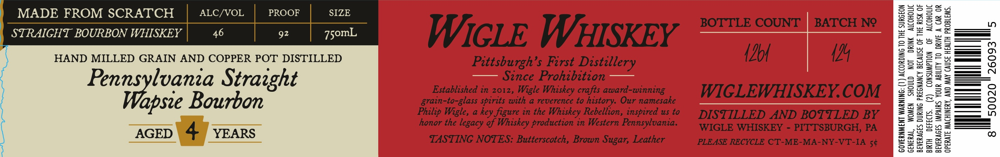

# TTB COLA Label Images - TTBID 26191001000280

**Brand Name:** WIGLE WHISKEY

**Issue Date:** 07/15/2026

**Origin Code:** 39

**Product Class/Type:** 101

**Source:** [TTB Public COLA Registry](https://ttbonline.gov/colasonline/viewColaDetails.do?action=publicFormDisplay&ttbid=26191001000280)

## Label Images

### Label 1

## Extracted Label Text

*Text extracted via OCR - may contain errors*

### Label 1

MADE FROM SCRATCH ALC/VOL PROOF SIZE

STRAIGHT BOURBON WHISKEY 46 92 7somL

HAND MILLED GRAIN AND COPPER POT DISTILLED
sa set Strazght
apsie Bourbon

AGED \ 4) YEARS

WICLE WHISKEY

Pittsburgh’s First Distillery

Stnce Prohibition

Established in 2012, Wigle Whiskey crafts award-winning
grain-to-glass spirits with a reverence to history. Our namesake
Philip Wigle, a key figure in the Whiskey Rebellion, inspired us to
honor the legacy of Whiskey production in Western Pennsylvania.

TASTING NOTES: Butterscotch, Brown Sugar, Leather

BOTTLE COUNT BATCH N9?

(Lo 4

WIGLEWHISKEY.COM

DISTILLED AND BOTTLED BY
WIGLE WHISKEY - PITTSBURGH, PA

PLEASE RECYCLE CT-ME-MA-NY-VT-IA 5¢

BIRTH DEFECTS. (2) CONSUMPTION OF ALCOHOLIC

GOVERNMENT WARNING: (1) ACCORDING TO THE SURGEON
GENERAL, WOMEN SHOULD NOT DRINK ALCOHOLIC
BEVERAGES DURING PREGNANCY BECAUSE OF THE RISK OF
BEVERAGES IMPAIRS YOUR ABILITY TO DRIVE A CAR OR

OPERATE MACHINERY, AND MAY CAUSE HEALTH PROBLEMS.

5

26093

50020

8
