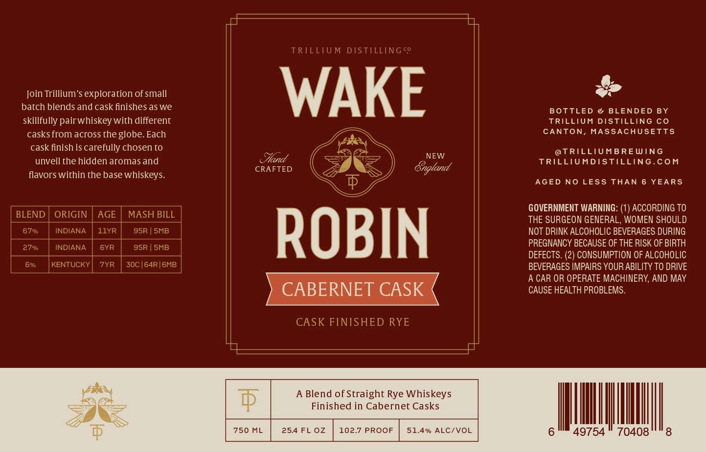

# TTB COLA Label Images - TTBID 26191001000317

**Brand Name:** TRILLIUM DISTILLING CO

**Issue Date:** 07/22/2026

**Origin Code:** 26

**Product Class/Type:** 122

**Source:** [TTB Public COLA Registry](https://ttbonline.gov/colasonline/viewColaDetails.do?action=publicFormDisplay&ttbid=26191001000317)

## Label Images

### Label 1

## Extracted Label Text

*Text extracted via OCR - may contain errors*

**Detected Proof:** 134
**Detected Age:** 6 Years

### Label 1

TRILLIUM DISTILLING co
Join Trillium'$ exploration of small
WAKE
batch blends and cask finishes as we
BOTTLED
@ BLENDED BY
skillfully pairwhiskey with different
TRILLIUM DISTILLING Co
casks from across the globe. Each
CANTON, MASSACHUSETTS
cask finish is carefully chosen t0
@TRILLIUMBREWING
NEW
unveil the hidden aromas and
TRILLIUMDISTILLING.CoM
CRAFTED
Gngland
flavors within the base whiskeys:
AGED NO LESS
THAN
6 YEARS
GOVERNMENT WARNING: (1) ACCORDING TO
BLEND
ORIGIN
AGE
MASH BILL
THE SURGEON GENERAL, WOMEN SHOULD
67%
INDIANA
11YR
95R | SMB
ROBIN
NOT DRINK ALCOHOLIC BEVERAGES DURING
2796
INDIANA
6YR
95R | SMB
PREGNANCY BECAUSE OF THE RISK OF BIRTH
DEFECTS. (2) CONSUMPTION OF ALCOHOLIC
6%6
KENTUCKY
7YR
30C |64R| 6MB
BEVERAGES IMPAIRS YOUR ABILITY TO DRIVE
A CAR OR OPERATE MACHINERY, AND MAY
CABERNET CASK
CAUSE HEALTH PROBLEMS .
CASK FINISHED RYE
A Blend of Straight Rye Whiskeys
$
Finished in Cabernet Casks
750 ML
254 FL 0z2
102.7 PROOF
51.4% ALC/VOL
49754
70408
and
