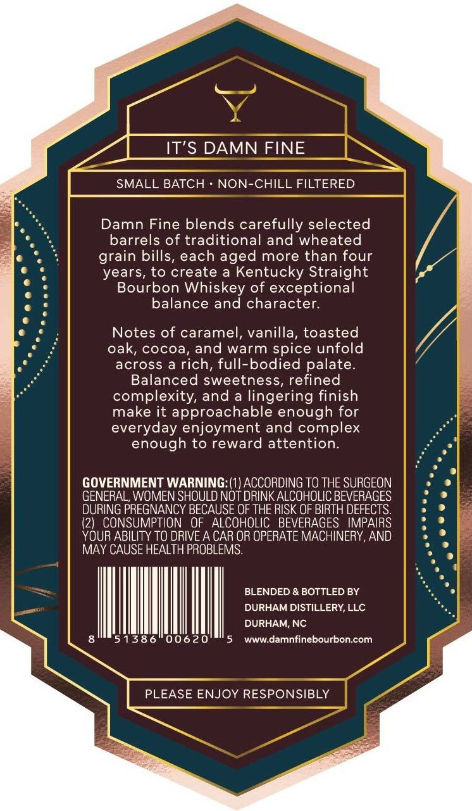
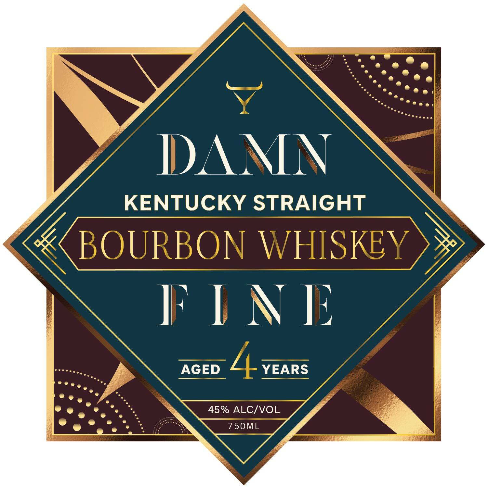

# TTB COLA Label Images - TTBID 26191001000353

**Brand Name:** DAMN FINE

**Issue Date:** 07/16/2026

**Origin Code:** 35

**Product Class/Type:** 101

**Source:** [TTB Public COLA Registry](https://ttbonline.gov/colasonline/viewColaDetails.do?action=publicFormDisplay&ttbid=26191001000353)

## Label Images

### Back Label

### Front Label

## Extracted Label Text

*Text extracted via OCR - may contain errors*

**Detected Proof:** 90

### Back Label

IT'S DAMN FINE
SMALL BATCH
NON-CHILL FILTERED
Damn Fine blends carefully selected
barrels of traditional and wheated
grain bills, each aged more than four
years, to create
Kentucky Straight
Bourbon Whiskey of exceptional
balance and character.
Notes of caramel, vanilla, toasted
oak, cocoa, and warm spice unfold
across
a rich, full-bodied palate_
Balanced sweetness, refined
complexity, and a lingering finish
make it approachable enough for
everyday enjoyment and complex
enough to reward attention:
GOVERNMENT WARNING: (1) ACCORDING TO THE SURGEON
GENERAL, WOMEN SHOULD NOT DRINK ALCOHOLIC BEVERAGES
DURING PREGNANCY BECAUSE OF THE RISK OF BIRTH DEFECTS
(21   CONSUMPTION
OF   ALCOHOLIC   BEVERAGES   IMPAIRS
YOUR ABILITY TO DRIVE A CAR OR OPERATE MACHINERY, AND
MAY CAUSE HEALTH PROBLEMS
BLENDED & BOTTLED BY
DURHAM DISTILLERY,LLC
DURHAM, NC
51386
00620
WWW.damnfinebourbon.com
PLEASE ENJOY RESPONSIBLY

### Front Label

IDAIV
KENTUCKY STRAIGHT
BOURBON WHISKEY
F INE
AGED
YEARS
45% ALCIVOL
750ML
