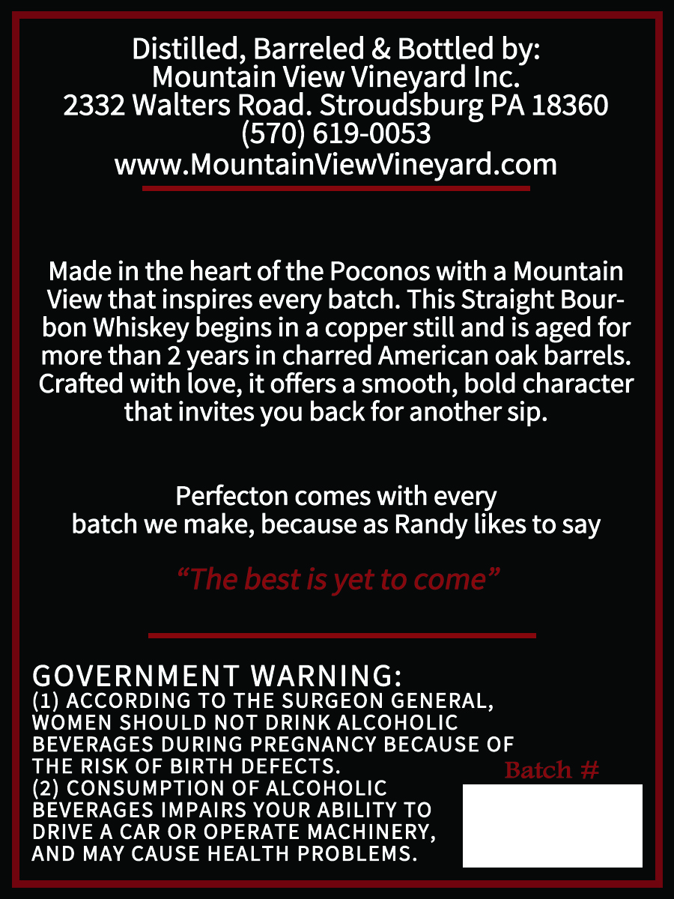
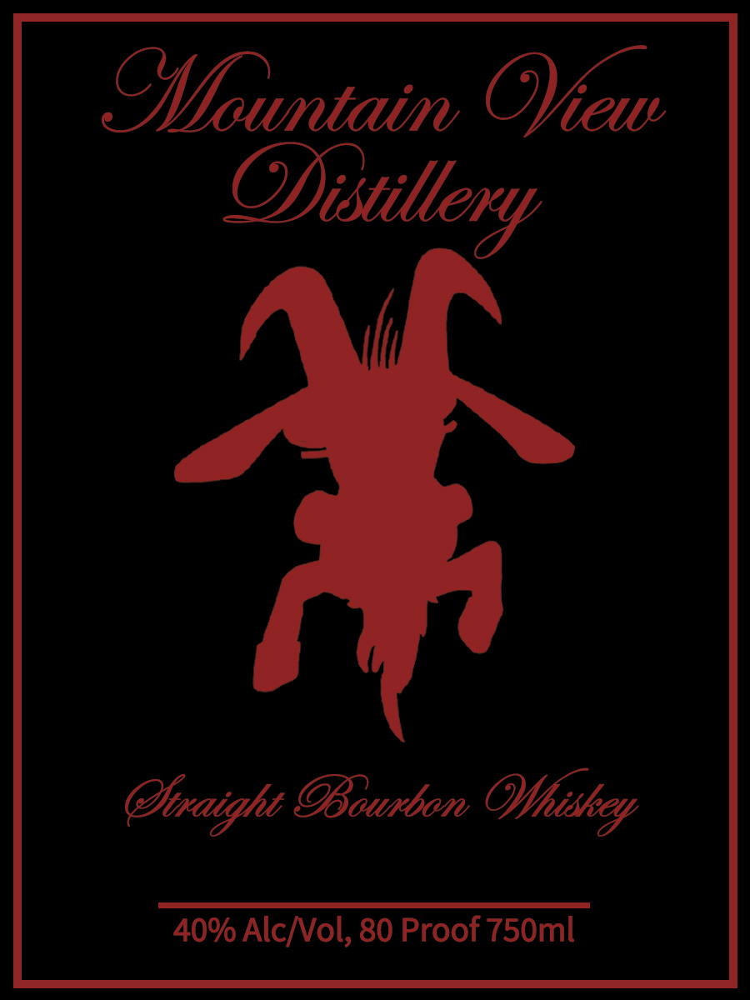

# TTB COLA Label Images - TTBID 26191001000434

**Brand Name:** MOUNTAIN VIEW DISTILLERY

**Issue Date:** 07/13/2026

**Origin Code:** 39

**Product Class/Type:** 101

**Source:** [TTB Public COLA Registry](https://ttbonline.gov/colasonline/viewColaDetails.do?action=publicFormDisplay&ttbid=26191001000434)

## Label Images

### Back Label

### Front Label

## Extracted Label Text

*Text extracted via OCR - may contain errors*

**Detected Proof:** 80
**Detected Age:** 2 Years

### Back Label

Distilled, Barreled & Bottled by:
Mountain View
Inc:
2332 Walters Road_
Stronaybudg
PA 18360
(570) 619-0053
WWW.MountainViewVineyard.com
Made in the heart ofthe Poconos with a Mountain
View that inspires every batch: This Straight Bour-
bon Whiskey begins in a copper still and iS aged for
more than 2 years in charred American oak barrels:
Crafted with love; it offers a smooth, bold character
that invites you back for another sip.
Perfecton comes with every
batch we make, because as Randy likes to say
"The best is yet to come
GOVERNMENT WARNING:
(1) ACCORDING TO THE SURGEON GENERAL,
WOMEN SHOULD NOT DRINK ALCOHOLIC
BEVERAGES DURING PREGNANCY BECAUSE OF
THE RISK OF BIRTH DEFECTS.
Batch #
(2) CONSUMPTION OF ALCOHOLIC
BEVERAGES IMPAIRS YOUR ABILITY TO
DRIVE A CAR OR OPERATE MACHINERY,
AND MAY CAUSE HEALTH PROBLEMS.

### Front Label

Ofountaim OYew
@taight OBourbon
40% AlcNol, 80 Proof 750ml
Ofistillery
N
Ofhiskey
