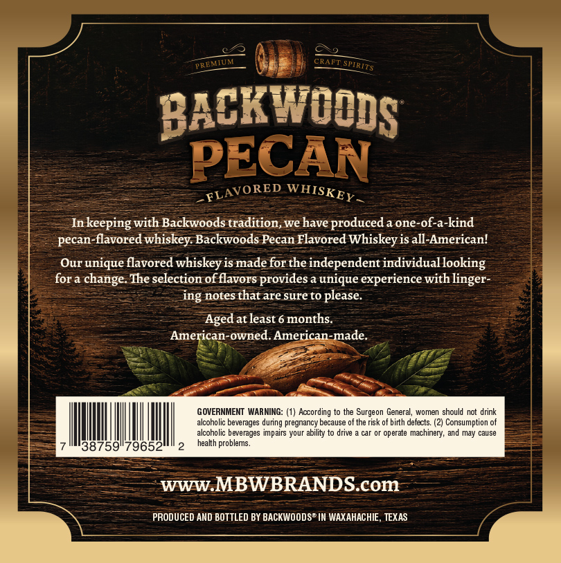
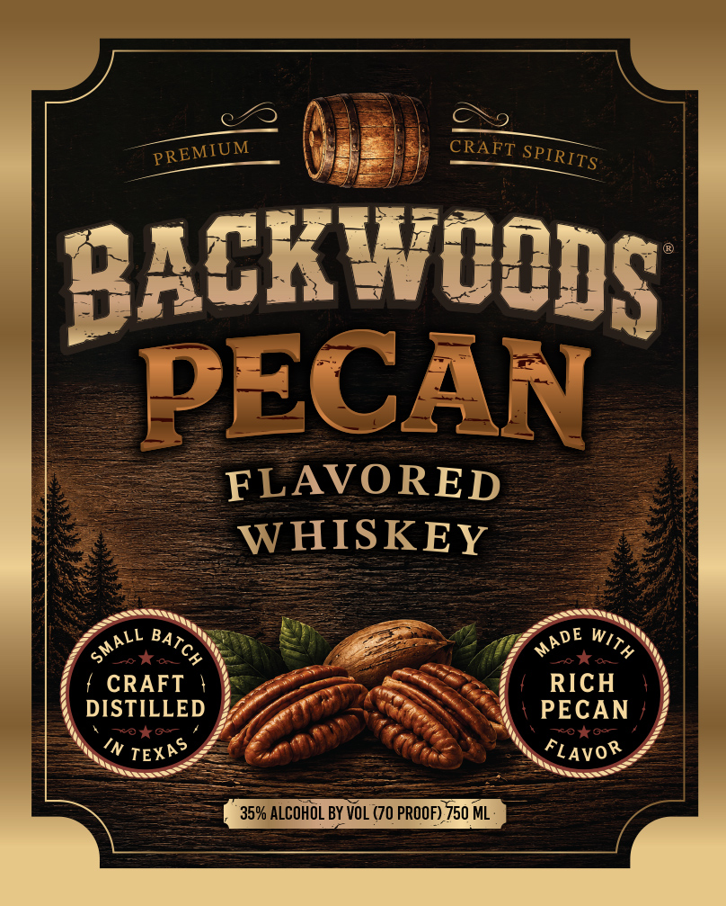

# TTB COLA Label Images - TTBID 26191001000488

**Brand Name:** BACKWOODS

**Issue Date:** 08/05/2026

**Origin Code:** 44

**Product Class/Type:** 149

**Source:** [TTB Public COLA Registry](https://ttbonline.gov/colasonline/viewColaDetails.do?action=publicFormDisplay&ttbid=26191001000488)

## Label Images

### Back Label

### Front Label

## Extracted Label Text

*Text extracted via OCR - may contain errors*

**Detected Proof:** 70

### Back Label

CRAFT
BACKWOODS
PECAN
Inkeeping with Backwoods tradition, we have produced a one-of-a-kind
pecan-flavored whiskey Backwoods Pecan Flavored Whiskey is all-American!
Our unique flavored whiskey is made forthe independent individual looking
fora change. The selection of flavors provides a unique experience with
ing notes that are sure to please:
Aged at least 6 months
American-owned. American-made
GOVERNMENT  WARNING: (1) Aocording to the Surgeon General, women should not drink
alcoholic beverages
pregnancy
because of the risk of birth defects. (2) Consumption of
alcoholic beverages impairs your ability to drive
car or operate
machinery, and may cause
38759"79652
health problems_
WWW MBWBRANDScom
PRODUCED AND BOTTLED BY BACKWOODS" IN WAXAHACHIE , TEXAS
PREMTUA
SPIRITS
-FLAVORED
WHISKEY
linger
during E

### Front Label

CRAFT
BACK WVOODS
PECAN
FLAVORED
WHISKEY
LO BOn
CRAFT
RICH
DISTILLED
PECAN
104G4
28
in
FLAVOR
35% ALCOHOL BY VOL (70 PROOF) 750 ML
PREMIUM
SPIRITS
MADE
With
SMALL
BATCH
TEXAS
