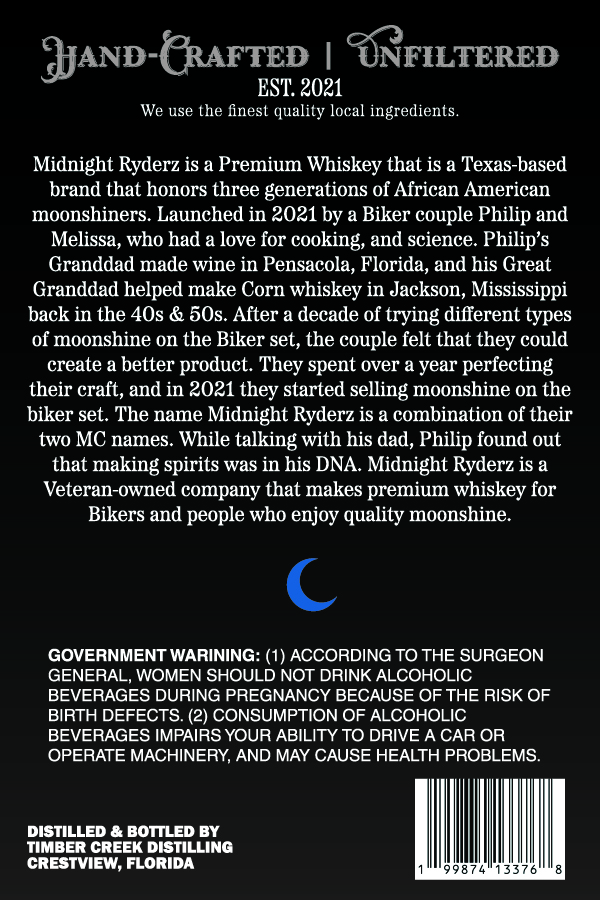
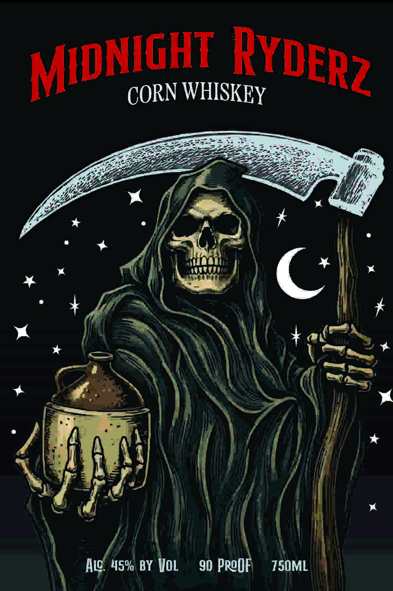

# TTB COLA Label Images - TTBID 26192001000036

**Brand Name:** MIDNIGHT RYDERZ

**Issue Date:** 07/17/2026

**Origin Code:** 16

**Product Class/Type:** 143

**Source:** [TTB Public COLA Registry](https://ttbonline.gov/colasonline/viewColaDetails.do?action=publicFormDisplay&ttbid=26192001000036)

## Label Images

### Back Label

### Front Label

## Extracted Label Text

*Text extracted via OCR - may contain errors*

**Detected Proof:** 90

### Back Label

JAND-GRAFTED
UNFILTERED
EST 2021
We use the finest quality local ingredients.
Midnight Ryderz is a Premium Whiskey that is a Texas-based
brand that honors three generations of African American
moonshiners: Launched in 2021 by a Biker couple Philip and
Melissa, who had a love for cooking; and science. Philip's
Granddad made wine in Pensacola, Florida, and his Great
Granddad helped make Corn whiskey in Jackson, Mississippi
back in the 4Os & 50s. After a decade of trying different types
of moonshine on the Biker set, the couple felt that
could
create a better product: They spent over a year perfecting
their craft, and in 2021 they started selling moonshine on the
biker set. The name Midnight Ryderz is a combination of their
two MC names: While talking with his dad, Philip found out
that making spirits was in his DNA. Midnight Ryderz is a
Veteran-owned company that makes premium whiskey for
Bikers and people who enjoy quality moonshine:
GOVERNMENT WARINING: (1) ACCORDING TO THE SURGEON
GENERAL, WOMEN SHOULD NOT DRINK ALCOHOLIC
BEVERAGES DURING PREGNANCY BECAUSE OF THE RISK OF
BIRTH DEFECTS: (2) CONSUMPTION OF ALCOHOLIC
BEVERAGES IMPAIRS YOUR ABILITY TO DRIVE A CAR OR
OPERATE MACHINERY; AND MAY CAUSE HEALTH PROBLEMS_
DISTILLED & BOTTLED BY
timber creek DISTILLING
CRESTVIEW; FLORIDA
they

### Front Label

WHISKEY
C
Hlc; 45% BY Vol
90 ProOF
TSOML
RyDERz
MIDNIGHT
CORN
